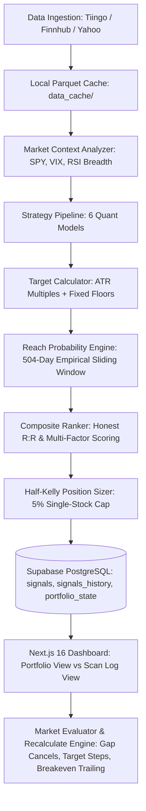
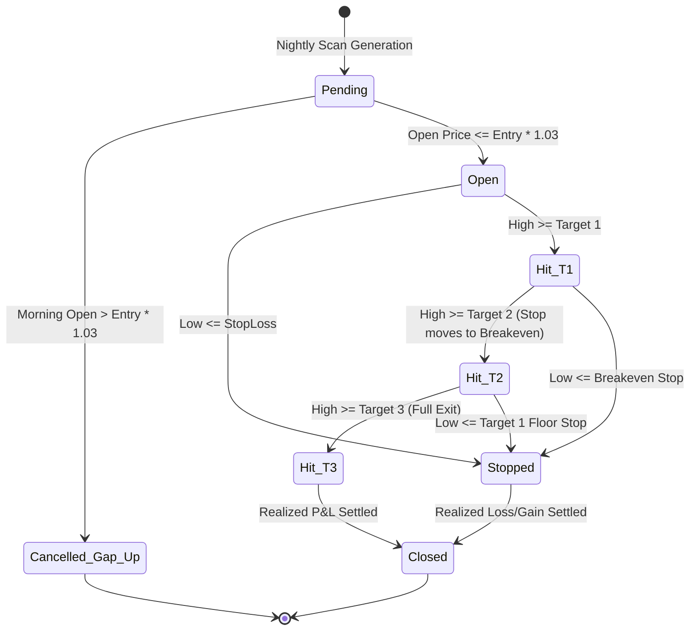

# Stock Recommendation Engine — Master Architecture & Quantitative Specification

> **Document Type**: Comprehensive Quantitative & Technical Architecture Specification  
> **Target Audience**: Quantitative Developers, Trading Systems Architects, and Large Language Models (LLMs)  
> **System Classification**: Multi-Strategy Systematic Equity Momentum & Mean-Reversion CTA Engine  
> **Primary Asset Universe**: S&P 500 (~502 constituents) + Selected Sector ETFs (~15 tickers)  
> **Version**: 2.2 (Post-Target Refactor, Live Recalculation Engine & Split Dashboard Architecture)  
> **Last Updated**: September 1, 2026  

---

## Table of Contents
1. [Executive Summary & Operational Paradigm](#1-executive-summary--operational-paradigm)
2. [End-to-End System Architecture](#2-end-to-end-system-architecture)
3. [Data Ingestion & Storage Architecture](#3-data-ingestion--storage-architecture)
4. [Macro Market Regime Detection](#4-macro-market-regime-detection)
5. [Strategy Mathematical Specifications](#5-strategy-mathematical-specifications)
6. [Strategy-Specific ATR Targets & Reach Probability Filtering](#6-strategy-specific-atr-targets--reach-probability-filtering)
7. [Multi-Factor Composite Scoring Engine](#7-multi-factor-composite-scoring-engine)
8. [Context & Multimodal NLP Scoring Pipeline](#8-context--multimodal-nlp-scoring-pipeline)
9. [Risk Management, Sizing & Capital Allocation Math](#9-risk-management-sizing--capital-allocation-math)
10. [Trade Lifecycle & Live Recalculation Engine](#10-trade-lifecycle--live-recalculation-engine)
11. [Dynamic Scale-Out Dollar Exit Breakdown](#11-dynamic-scale-out-dollar-exit-breakdown)
12. [Split Dashboard: Portfolio View vs. Scan Log Architecture](#12-split-dashboard-portfolio-view-vs-scan-log-architecture)
13. [Real-World Production Calculation Walkthroughs](#13-real-world-production-calculation-walkthroughs)
14. [Quantitative Expectancy & Probabilistic Edge Proof](#14-quantitative-expectancy--probabilistic-edge-proof)
15. [Database Schema & Data Flow Specification](#15-database-schema--data-flow-specification)
16. [Master Rules & Invariants for LLM Agents](#16-master-rules--invariants-for-llm-agents)

---

## 1. Executive Summary & Operational Paradigm

The **Stock Recommendation Engine** is an institutional-grade, fully systematic swing trading engine. It operates on an **Asymmetric CTA Trend-Following & Momentum Paradigm**:
- **Philosophy**: We do not predict market direction. We exploit structural market inefficiencies (post-earnings drift, 52-week breakout momentum, sector capital rotation, and oversold pullbacks in established secular trends).
- **Core Edge**: Asymmetric pay-off profiles where $\text{Average Win} \ge 2.5 \times \text{Average Loss}$ with an empirical win rate $P_{\text{win}} \in [45\%, 65\%]$.
- **Execution Mechanism**: Nightly batch scanning (via Python / Supabase / GitHub Actions) coupled with real-time intraday monitoring, trailing stop ratcheting, empirical reach-probability filtering, and live reconciliation in Next.js 16.

```
                    ┌──────────────────────────────────────────────┐
                    │               502 Ticker Universe            │
                    └──────────────────────┬───────────────────────┘
                                           │
                                           ▼
                    ┌──────────────────────────────────────────────┐
                    │   Macro Market Regime Detection (SPY + VIX)  │
                    │       Bullish | Bearish | Sideways           │
                    └──────────────────────┬───────────────────────┘
                                           │
                                           ▼
                    ┌──────────────────────────────────────────────┐
                    │       6 Autonomous Quantitative Strategies   │
                    │   (Trend, Breakout, Pullback, PEAD, XS, Sec) │
                    └──────────────────────┬───────────────────────┘
                                           │
                                           ▼
                    ┌──────────────────────────────────────────────┐
                    │   Strategy-Specific ATR Targets + Floors     │
                    │      + 504-Day Reach Probability Filter      │
                    │           (Ghost Target Pruning)             │
                    └──────────────────────┬───────────────────────┘
                                           │
                                           ▼
                    ┌──────────────────────────────────────────────┐
                    │     Multi-Factor Composite Scoring (0-100)   │
                    │   (Momentum, Expectancy, WinRate, Context)   │
                    └──────────────────────┬───────────────────────┘
                                           │
                                           ▼
                    ┌──────────────────────────────────────────────┐
                    │   Half-Kelly Sizing with Strict 5.0% Cap     │
                    │    + Cash-Constrained Capital Normalization  │
                    └──────────────────────┬───────────────────────┘
                                           │
                     ┌─────────────────────┴─────────────────────┐
                     ▼                                           ▼
      ┌─────────────────────────────┐             ┌─────────────────────────────┐
      │  Portfolio View (Alloc > 0) │             │   Scan Log View (Alloc = 0) │
      │   Active Funded Positions   │             │   Rejected / Filtered Log   │
      │   (e.g., CRL: $30.42 alloc) │             │   (e.g., PLTR, DASH: $0)    │
      └─────────────────────────────┘             └─────────────────────────────┘
```

---

## 2. End-to-End System Architecture



### Key Components
1. **`jobs/generate_signals.py`**: Nightly pipeline that orchestrates universe fetching, indicators, strategies, reach probability pruning, Half-Kelly sizing, and database synchronization.
2. **`src/strategies/target_calculator.py`**: Calculates strategy ATR multiples, enforces percentage floors, queries 504-day sliding reach probabilities, prunes unreachable targets, and calculates $R_{\text{honest}}$.
3. **`src/ranker.py`**: Computes multi-factor composite scores (0–100) and applies regime-dependent weighting vectors.
4. **`src/providers/context/`**: Multimodal contextual scoring engine (Analyst consensus, Earnings surprise, Fundamental health, FinBERT news sentiment).
5. **`frontend/src/lib/position-utils.ts`**: Frontend math engine for scale-out weights, exact dollar-exit milestones, and share allocations.
6. **`frontend/src/lib/database.ts`**: Isomorphic query functions (`fetchPortfolioSignals`, `fetchScanLogSignals`, `getRejectionReason`).
7. **`frontend/src/app/api/signals/recalculate/route.ts`**: Real-time trade lifecycle reconciliation server route.

---

## 3. Data Ingestion & Storage Architecture

### Primary Data Providers
- **Tiingo IEX API**: Primary for real-time and end-of-day adjusted OHLCV quotes.
- **Finnhub API**: Secondary for intraday quotes and analyst consensus data.
- **Yahoo Finance API**: Tertiary fallback for historical quotes and supplementary market breadth indicators.

### Parquet Caching & Data Hygiene
- Historical constituent daily bars are stored locally as compressed Apache Parquet files: `data_cache/{ticker}.parquet`.
- **Hygiene & Validation Rules**:
  - Parquet frames are verified for non-empty records and monotonically increasing timestamps.
  - Zero, negative, and `NaN` prices are strictly rejected before persistence to prevent moving average corruption.
  - Minimum lookback requirement: **504 trading days** (~2 full calendar years) to support empirical target reach probability calculations.

---

## 4. Macro Market Regime Detection

Market Regime is evaluated on every scan to determine overall market risk posture and adjust composite weighting vectors.

### Inputs:
1. $P_{\text{SPY}}$: Current closing price of SPDR S&P 500 ETF Trust (SPY).
2. $\text{SMA}_{50}(\text{SPY})$, $\text{SMA}_{200}(\text{SPY})$: 50-day and 200-day Simple Moving Averages.
3. $\text{VIX}$: CBOE Volatility Index closing price.
4. $\text{Breadth}_{\text{RSI}}$: Percentage of S&P 500 universe with $\text{RSI}_{14} > 50.0$.

### Classification State Machine:
$$\text{Regime} = \begin{cases} 
\mathbf{BULL}, & \text{if } P_{\text{SPY}} > \text{SMA}_{200}(\text{SPY}) \text{ and } \text{VIX} < 22.0 \text{ and } \text{Breadth}_{\text{RSI}} \ge 50\% \\ 
\mathbf{BEAR}, & \text{if } P_{\text{SPY}} < \text{SMA}_{200}(\text{SPY}) \text{ or } \text{VIX} \ge 28.0 \\ 
\mathbf{SIDEWAYS}, & \text{otherwise (e.g., } 22.0 \le \text{VIX} < 28.0 \text{ or mixed moving average alignment)} 
\end{cases}$$

### Composite Scoring Weight Vectors by Regime:
| Factor Sub-Score | Bull Regime Weight ($W_{\text{bull}}$) | Sideways Regime Weight ($W_{\text{side}}$) | Bear Regime Weight ($W_{\text{bear}}$) |
| :--- | :---: | :---: | :---: |
| **Momentum** | **35%** ($0.35$) | **25%** ($0.25$) | **15%** ($0.15$) |
| **Expectancy** | **25%** ($0.25$) | **30%** ($0.30$) | **35%** ($0.35$) |
| **Past Win Rate** | **15%** ($0.15$) | **20%** ($0.20$) | **25%** ($0.25$) |
| **Regime Alignment**| **15%** ($0.15$) | **15%** ($0.15$) | **15%** ($0.15$) |
| **Context & NLP** | **10%** ($0.10$) | **10%** ($0.10$) | **10%** ($0.10$) |

---

## 5. Strategy Mathematical Specifications

The engine executes 6 distinct quantitative strategies. Each strategy enforces rigid mathematical entry conditions and custom initial stop-loss anchoring:

### 1. Trend Following (`trend_following`)
- **Core Thesis**: Ride medium-to-long term momentum trends in institutional market leaders.
- **Entry Rules**:
  $$\text{Close} > \text{EMA}_{20} > \text{EMA}_{50} > \text{SMA}_{200} \quad \text{and} \quad \text{ADX}_{14} \ge 25.0 \quad \text{and} \quad \text{MACD}_{\text{hist}} > 0$$
- **Stop Loss Calculation**:
  $$\text{Stop}_{\text{raw}} = \min(\text{LowestLow}_{10}, P_{\text{entry}} - 2.5 \times \text{ATR}_{14})$$
  $$\text{Stop}_{\text{final}} = \max(\text{Stop}_{\text{raw}}, P_{\text{entry}} \times 0.93) \quad \text{[Bounded by 7.0\% max loss]}$$

### 2. 52-Week High Breakout (`week_52_high`)
- **Core Thesis**: Exploits institutional anchor bias on 52-week highs (George & Hwang, 2004).
- **Entry Rules**:
  $$P_{\text{entry}} \ge 0.97 \times \text{High}_{252} \quad \text{and} \quad \text{Volume}_{\text{today}} \ge 1.5 \times \text{SMA}_{\text{Vol}, 20}$$
- **Stop Loss Calculation**:
  $$\text{Stop}_{\text{raw}} = \min(\text{SMA}_{50} \times 0.97, \text{High}_{252} \times 0.95, P_{\text{entry}} - 2.0 \times \text{ATR}_{14})$$
  $$\text{Stop}_{\text{final}} = \max(\text{Stop}_{\text{raw}}, P_{\text{entry}} \times 0.93)$$

### 3. Pullback Recovery (`pullback_recovery`)
- **Core Thesis**: Buys temporary liquidations inside primary secular bull uptrends.
- **Entry Rules**:
  $$\text{Close} > \text{SMA}_{200} \quad \text{and} \quad \min_{t \in [t-10, t]}(\text{RSI}_{14}(t)) \le 35.0 \quad \text{and} \quad \text{RSI}_{14}(\text{today}) > 40.0$$
- **Stop Loss Calculation**:
  $$\text{Stop}_{\text{raw}} = \min(\text{LowestLow}_{10}, P_{\text{entry}} - 2.0 \times \text{ATR}_{14})$$
  $$\text{Stop}_{\text{final}} = \max(\text{Stop}_{\text{raw}}, P_{\text{entry}} \times 0.93)$$

### 4. Post-Earnings Announcement Drift (`pead`)
- **Core Thesis**: Systematic capture of multi-week institutional earnings post-announcement drift.
- **Entry Rules**:
  $$\text{GapPct} = \frac{\text{Open}_{\text{earnings}} - \text{Close}_{\text{prior}}}{\text{Close}_{\text{prior}}} \ge +3.0\% \quad \text{and} \quad \text{Volume}_{\text{earnings}} \ge 2.0 \times \text{SMA}_{\text{Vol}, 20}$$
- **Stop Loss Calculation**:
  $$\text{Stop}_{\text{raw}} = \min(\text{Low}_{\text{earnings\_gap}} \times 0.98, P_{\text{entry}} - 2.0 \times \text{ATR}_{14})$$
  $$\text{Stop}_{\text{final}} = \max(\text{Stop}_{\text{raw}}, P_{\text{entry}} \times 0.93)$$

### 5. Cross-Sectional Momentum (`cross_sectional_momentum`)
- **Core Thesis**: Relative strength ranking against the entire S&P 500 universe over 3-month and 6-month horizons.
- **Entry Rules**:
  $$\text{MomentumScore} = 0.6 \times \left(\frac{P_t - P_{t-63}}{P_{t-63}}\right) + 0.4 \times \left(\frac{P_t - P_{t-126}}{P_{t-126}}\right) \ge 90\text{th percentile}$$
- **Stop Loss Calculation**:
  $$\text{Stop}_{\text{raw}} = P_{\text{entry}} - 2.5 \times \text{ATR}_{14}$$
  $$\text{Stop}_{\text{final}} = \max(\text{Stop}_{\text{raw}}, P_{\text{entry}} \times 0.93)$$

### 6. Sector Rotation (`sector_rotation`)
- **Core Thesis**: Capital flows into the top 2 outperforming Sector SPDR ETFs (XLE, XLK, XLF, XLI, XLV, etc.).
- **Entry Rules**:
  $$\text{SectorRelStrength} = \frac{\text{Return}_{20}(\text{ETF})}{\text{Return}_{20}(\text{SPY})} > 1.05 \quad \text{and ETF constituent breakout}$$
- **Stop Loss Calculation**:
  $$\text{Stop}_{\text{raw}} = \min(\text{EMA}_{20} \times 0.98, P_{\text{entry}} - 2.0 \times \text{ATR}_{14})$$
  $$\text{Stop}_{\text{final}} = \max(\text{Stop}_{\text{raw}}, P_{\text{entry}} \times 0.93)$$

---

## 6. Strategy-Specific ATR Targets & Reach Probability Filtering

Global fixed percentage targets (+12%, +22%, +35%) fail in production because low-volatility large caps rarely reach +35% within swing horizons, while high-beta momentum stocks overshoot +12% on day two. We deploy a **Two-Layer Quantitative Target Framework**:

### Layer 1: Strategy-Specific ATR Target Multiples & Percentage Floors
Profit targets are computed dynamically as a function of the stock's 14-day Average True Range ($\text{ATR}_{14}$), bounded by fixed minimum percentage floors:

$$T_{k, \text{atr}} = P_{\text{entry}} + M_k \times \text{ATR}_{14}$$
$$T_k = \max\left(T_{k, \text{atr}}, P_{\text{entry}} \times (1 + \text{Floor}_k)\right)$$

#### Strategy Multiplier & Floor Matrix:
| Strategy Name | T1 ATR ($M_1$) | T1 Floor | T2 ATR ($M_2$) | T2 Floor | T3 ATR ($M_3$) | T3 Floor |
| :--- | :---: | :---: | :---: | :---: | :---: | :---: |
| **Trend Following** | $2.5\times$ | $+6.0\%$ | $5.0\times$ | $+14.0\%$ | $8.0\times$ | $+22.0\%$ |
| **52-Week High Breakout** | $2.0\times$ | $+5.0\%$ | $4.5\times$ | $+12.0\%$ | $7.0\times$ | $+20.0\%$ |
| **Pullback Recovery** | $2.0\times$ | $+5.0\%$ | $4.0\times$ | $+10.0\%$ | $6.5\times$ | $+18.0\%$ |
| **PEAD (Earnings Drift)** | $3.0\times$ | $+8.0\%$ | $6.0\times$ | $+16.0\%$ | $9.0\times$ | $+28.0\%$ |
| **Cross-Sectional Momentum**| $2.5\times$ | $+6.0\%$ | $5.0\times$ | $+13.0\%$ | $7.5\times$ | $+22.0\%$ |
| **Sector Rotation** | $2.0\times$ | $+5.0\%$ | $4.0\times$ | $+11.0\%$ | $6.0\times$ | $+18.0\%$ |

---

### Layer 2: 504-Day Empirical Reach Probability Filtering
For each proposed target $T_k$, the system queries the constituent's historical daily price bars over the preceding **504 trading days** (~2 years) using a sliding 60-trading-day forward window:

$$P(\text{reach}_k) = \frac{\sum_{i=1}^{N} \mathbb{I}\left(\max_{t \in [i, i+60]}(P_t) \ge P_i \times \left(1 + \frac{T_k - P_{\text{entry}}}{P_{\text{entry}}}\right)\right)}{N}, \quad \text{where } N = 504 - 60 = 444$$

#### Minimum Empirical Survival Thresholds:
- **Target 1 ($T_1$)**: Must satisfy $P(\text{reach}_1) \ge 0.50$ ($50\%$). If $P(\text{reach}_1) < 0.50$, the entire signal is **REJECTED** immediately.
- **Target 2 ($T_2$)**: Must satisfy $P(\text{reach}_2) \ge 0.30$ ($30\%$). If $P(\text{reach}_2) < 0.30$, $T_2$ is **PRUNED** ($T_2 = \text{null}$).
- **Target 3 ($T_3$)**: Must satisfy $P(\text{reach}_3) \ge 0.15$ ($15\%$). If $P(\text{reach}_3) < 0.15$, $T_3$ is **PRUNED** ($T_3 = \text{null}$).

---

### Dynamic Scale-Out Assignment & Honest R:R Math
When ghost targets are pruned, the system dynamically reassigns scale-out exit weights:

$$\text{Scale-Out Structure} = \begin{cases} 
\mathbf{"50/30/20"}, & \text{if both } T_2 \text{ and } T_3 \text{ survive} \\ 
\mathbf{"60/30/10"}, & \text{if } T_2 \text{ survives but } T_3 \text{ is pruned (10\% trailing runner)} \\ 
\mathbf{"70/30/0"}, & \text{if both } T_2 \text{ and } T_3 \text{ are pruned (30\% trailing runner)} 
\end{cases}$$

#### Honest Weighted Risk-to-Reward Ratio ($R_{\text{honest}}$):
$$R_{\text{honest}} = \frac{\sum_{k \in \text{surviving}} \left(w_k \times \frac{T_k - P_{\text{entry}}}{P_{\text{entry}}}\right) + \left(w_{\text{runner}} \times 1.20 \times \frac{T_1 - P_{\text{entry}}}{P_{\text{entry}}}\right)}{\frac{P_{\text{entry}} - \text{StopLoss}}{P_{\text{entry}}}}$$

*Why this is critical*: Calculating risk-to-reward over unattainable ghost targets artificially inflates $R$, causing the Half-Kelly formula to over-allocate capital to low-probability setups. $R_{\text{honest}}$ guarantees that position sizing reflects strictly achievable mathematical expectancy.

---

## 7. Multi-Factor Composite Scoring Engine (v2.2 Architecture)

Each surviving candidate setup is scored on an objective, normalized scale of **0.0 to 100.0**:

$$\text{Score}_{\text{composite}} = w_{\text{mom}} S_{\text{mom}} + w_{\text{exp}} S_{\text{exp}} + w_{\text{wr}} S_{\text{wr}} + w_{\text{reg}} S_{\text{reg}} + w_{\text{ctx}} S_{\text{ctx}}$$

### 1. Strategy-Specific Weight Vectors (Fix 4)
Rather than using broad regime-wide weights, weights are strictly tailored to each strategy's alpha drivers:

| Strategy | Momentum ($w_{\text{mom}}$) | Expectancy ($w_{\text{exp}}$) | Win Rate ($w_{\text{wr}}$) | Regime ($w_{\text{reg}}$) | Context ($w_{\text{ctx}}$) | Sum |
| :--- | :---: | :---: | :---: | :---: | :---: | :---: |
| **Trend Following** | 0.45 | 0.20 | 0.15 | 0.10 | 0.10 | **1.00** |
| **52-Week High Breakout** | 0.35 | 0.20 | 0.20 | 0.15 | 0.10 | **1.00** |
| **Pullback Recovery** | 0.20 | 0.25 | 0.20 | 0.10 | 0.25 | **1.00** |
| **Cross-Sectional Momentum** | 0.40 | 0.20 | 0.20 | 0.10 | 0.10 | **1.00** |
| **PEAD** | 0.15 | 0.30 | 0.15 | 0.10 | 0.30 | **1.00** |
| **Sector Rotation** | 0.25 | 0.25 | 0.20 | 0.20 | 0.10 | **1.00** |
| **Mean Reversion** | 0.10 | 0.20 | 0.15 | 0.15 | 0.40 | **1.00** |

### 2. Sub-Score Formulations:
1. **Momentum Sub-Score ($S_{\text{mom}} \in [0, 100]$)**:
   $$S_{\text{mom}} = 50 + 25 \times \left(\frac{\text{ADX}_{14} - 25}{25}\right) + 25 \times \text{clip}\left(\frac{\text{Return}_{20\text{d}}}{0.15}, -1.0, 1.0\right)$$
2. **Expectancy Sub-Score ($S_{\text{exp}} \in [0, 100]$) (Fix 2: No Circular R:R Dependency)**:
   $R_{\text{honest}}$ is eliminated from the composite score and reserved solely for Half-Kelly position sizing. $S_{\text{exp}}$ uses historical strategy backtest expectancy:
   $$S_{\text{exp}} = \text{clip}\left(\frac{\text{StrategyHistExpectancy}_{\%} + 2.0}{10.0} \times 100.0, 0.0, 100.0\right)$$
   *Lookups*: PEAD: +2.25% ($S_{\text{exp}}=42.5$), 52w Breakout: +2.10% ($S_{\text{exp}}=41.0$), Cross-Sectional: +1.80% ($S_{\text{exp}}=38.0$), Trend Following: +1.69% ($S_{\text{exp}}=36.9$), Pullback: +1.45% ($S_{\text{exp}}=34.5$), Sector Rotation: +1.20% ($S_{\text{exp}}=32.0$), Mean Reversion: +0.85% ($S_{\text{exp}}=28.5$).
3. **Past Win Rate Sub-Score ($S_{\text{wr}} \in [0, 100]$)**:
   $$S_{\text{wr}} = \text{clip}\left(\text{WinRate}_{\text{historical}} \times 100.0, 0.0, 100.0\right)$$
4. **Continuous Strategy-Dependent Regime Alignment ($S_{\text{reg}} \in [0, 100]$) (Fix 5)**:
   $$S_{\text{reg}} = \text{clip}\left(100.0 - |S_{\text{opt}} - S_{\text{mkt}}| \times 0.6, 0.0, 100.0\right)$$
   Where $S_{\text{mkt}} \in \{\text{Bull}: 100, \text{Sideways}: 50, \text{Bear}: 0\}$.
   - Trend Following / 52w Breakout ($S_{\text{opt}} = 100$): Bull = 100.0, Sideways = 70.0, Bear = 40.0.
   - Cross-Sectional / Sector Rotation ($S_{\text{opt}} = 75$): Bull = 85.0, Sideways = 85.0, Bear = 55.0.
   - Pullback / PEAD ($S_{\text{opt}} = 50$): Bull = 70.0, Sideways = 100.0, Bear = 70.0.
   - Mean Reversion ($S_{\text{opt}} = 0$): Bull = 40.0, Sideways = 70.0, Bear = 100.0.
5. **Context Sub-Score with Veto Gates ($S_{\text{ctx}} \in [0, 100]$) (Fix 3)**:
   Evaluated through fundamental health, news sentiment, and analyst consensus with hard veto rules.

### Tier Classification:
$$\text{Tier} = \begin{cases} 
\mathbf{Strong\ Buy}, & \text{if } \text{Score}_{\text{composite}} \ge 80.0 \text{ and } R_{\text{honest}} \ge 1.50 \\ 
\mathbf{Buy}, & \text{if } 65.0 \le \text{Score}_{\text{composite}} < 80.0 \text{ and } R_{\text{honest}} \ge 1.20 \\ 
\mathbf{Neutral / Rejected}, & \text{otherwise} 
\end{cases}$$

---

## 8. Context & Multimodal NLP Pipeline with Veto Gates (Fix 3)

The raw Context Score aggregates 4 external fundamental, analyst, and sentiment data feeds (0 to 100 pts total):
$$\text{RawContext} = \text{Score}_{\text{analyst}} + \text{Score}_{\text{earnings}} + \text{Score}_{\text{fund}} + \text{Score}_{\text{news}}$$

```
┌─────────────────────────────────────────────────────────────┐
│                 Raw Context Score (100 pts max)             │
├──────────────────────────────┬──────────────────────────────┤
│ Analyst Consensus (40 pts)   │ Earnings Surprise (30 pts)   │
│ - Buy/Hold/Sell ratios       │ - Last quarter EPS beat %    │
│ - Target price upside %      │ - Revenue surprise %         │
├──────────────────────────────┼──────────────────────────────┤
│ Fundamental Health (20 pts)  │ FinBERT NLP Sentiment (10 pts│
│ - Debt-to-Equity ratio       │ - 7-day headline sentiment   │
│ - Current Ratio              │ - Positive/Negative polarity │
└──────────────────────────────┴──────────────────────────────┘
```

### Deterministic Veto Gates:
1. **Leverage & Liquidity Veto**: If $\text{Debt-to-Equity} > 2.0$ and $\text{Current Ratio} < 0.8$:
   $$\text{ContextScore} = \min(\text{RawContext}, 30.0)$$
2. **FinBERT News Sentiment Veto**: If $\text{FinBERT Sentiment} < -0.20$:
   $$\text{ContextScore} = \min(\text{RawContext}, 40.0)$$
3. **Earnings Miss Penalty**: If $\text{Earnings Surprise} < -5.0\%$:
   $$\text{ContextScore} = \text{RawContext} - 20.0$$
4. **Analyst Downside Penalty**: If $\text{Consensus Target} < \text{Current Price}$:
   $$\text{ContextScore} = \text{RawContext} - 15.0$$
Final score is clipped: $S_{\text{ctx}} = \text{clip}(\text{ContextScore}, 0.0, 100.0)$.

---

## 9. Risk Management, Sizing & Capital Allocation Math

Capital allocation is governed by the **Constrained Half-Kelly Sizing Model with Sigmoid Win Probability and 5.0% Single-Stock Cap**:

### 1. Sigmoid Win-Probability Mapping (Fix 1)
Replacing coarse step-buckets, win probability is interpolated smoothly from composite score:
$$P_{\text{win}} = 0.35 + \frac{0.40}{1 + e^{-0.15 \times (\text{Score}_{\text{composite}} - 65)}}$$
Output is clamped: $P_{\text{win}} = \text{clip}(P_{\text{win}}, 0.35, 0.75)$, rounded to 4 decimal places.

### 2. Full Kelly Fraction ($f^*$)
$$f^* = P_{\text{win}} - \frac{1 - P_{\text{win}}}{R_{\text{honest}}}$$

### 3. Half-Kelly Fraction ($f_{\text{half}}$)
$$f_{\text{half}} = \max\left(0.0, \frac{f^*}{2}\right)$$

### 4. Single-Stock 5.0% Portfolio Cap Rule
$$\text{AllocationPct} = \min\left(f_{\text{half}} \times 100\%, 5.0\%\right)$$
$$\text{RawDemandDollars}_i = \text{PortfolioValue} \times \left(\frac{\text{AllocationPct}_i}{100}\right)$$

### 5. Cash-Constrained Cross-Sectional Normalization
If aggregate dollar demand across all qualified signals exceeds available cash:
$$\text{TotalDemand} = \sum_{i=1}^{K} \text{RawDemandDollars}_i$$
$$\text{ScalingFactor} = \min\left(1.0, \frac{\text{AvailableCash}}{\text{TotalDemand}}\right)$$
$$\text{AllocatedDollars}_i = \text{round}\left(\text{RawDemandDollars}_i \times \text{ScalingFactor}, 2\right)$$

### 6. Canonical Fractional Shares vs Integer Fallback
- Canonical Broker Order Sizing:
  $$\text{exact\_shares}_i = \text{round}\left(\frac{\text{AllocatedDollars}_i}{P_{\text{entry}, i}}, 4\right) \quad \text{[NUMERIC(10, 4)]}$$
- Database Backward-Compatibility Fallback:
  $$\text{max\_shares}_i = \text{int}\left(\text{floor}(\text{exact\_shares}_i)\right) \quad \text{[INTEGER]}$$

---

## 10. Trade Lifecycle & Live Recalculation Engine

The Next.js 16 live reconciliation engine (`/api/signals/recalculate`) manages real-time position transitions:



### Recalculation Invariants:
1. **Morning Open Gap Rule**: If $\text{Open}_{\text{morning}} > P_{\text{entry}} \times 1.03$ (+3.0% gap), the setup is cancelled (`cancelled_gap_up`) to prevent chasing extended prices into unfavorable risk-to-reward ratios.
2. **Breakeven Stop Ratchet**: Upon reaching $T_1$, the active stop loss is automatically ratcheted to $P_{\text{entry}}$, making the remaining shares risk-free.
3. **Trailing Stop Ratchet**: Upon reaching $T_2$, the stop loss is ratcheted to $T_1$.

---

## 11. Dynamic Scale-Out Dollar Exit Breakdown

When a position is funded with $\text{AllocatedDollars} > \$0$, capital recovery milestones are computed according to the assigned scale-out weight string:

### Scale-Out Mathematical Formulations:

$$\text{For Scale } w_1 / w_2 / w_3 \text{ with Allocated Capital } C:$$

$$T_1 \$ = C \times \left(\frac{w_1}{100}\right) \times \left(\frac{T_1}{P_{\text{entry}}}\right)$$
$$T_2 \$ = C \times \left(\frac{w_2}{100}\right) \times \left(\frac{T_2}{P_{\text{entry}}}\right) \quad [\text{if } T_2 \ne \text{null}]$$
$$T_3 \$ = C \times \left(\frac{w_3}{100}\right) \times \left(\frac{T_3}{P_{\text{entry}}}\right) \quad [\text{if } T_3 \ne \text{null}]$$
$$\text{Runner } \$ = C \times \left(\frac{w_{\text{runner}}}{100}\right) \times \left(\frac{P_{\text{current}}}{P_{\text{entry}}}\right) \quad [\text{for trailing runner}]$$

$$\text{Cash Recovered at } T_1 = C \times \left(\frac{w_1}{100}\right) \times \left(1 + \text{Return}_{T1}\right)$$
$$\text{Remaining Risk-Free Capital} = C - \left(C \times \frac{w_1}{100}\right)$$

---

## 12. Split Dashboard: Portfolio View vs. Scan Log Architecture

To eliminate visual pollution and prevent rejected setups from distorting P&L tracking, the dashboard splits records into two isolated tabs:

```
┌───────────────────────────────────────┬───────────────────────────────────────┐
│        💼 Portfolio (Default)         │              📄 Scan Log              │
│  Signals where allocated_dollars > 0  │ Signals where allocated_dollars = 0   │
│  AND status IN (pending, open, etc.)  │ OR status IN (rejected, cancelled)    │
└───────────────────────────────────────┴───────────────────────────────────────┘
```

### Tab Behavior & Isolation Rules:

| Feature / Property | 💼 Portfolio View (Tab 1) | 📄 Scan Log View (Tab 2) |
| :--- | :--- | :--- |
| **SQL Query** | `allocated_dollars > 0 AND status IN ('pending', 'open', 'hit_t1', 'hit_t2')` | `allocated_dollars = 0 OR status IN ('rejected', 'cancelled_gap_up')` |
| **Default Tab** | **Yes** (Active on page load) | No |
| **Columns Rendered** | Ticker, Entry/Stop, Current Price, Targets, Exit $ (Scale), P&L, Days | Ticker, Strategy, Tier, Composite Score, Honest R:R, Reason, Scan Date |
| **P&L Column** | **Active** (Sums realized + unrealized gains on allocated capital) | **Omitted** (No P&L on decisions) |
| **Recalculate Button**| **Active** (Only operates on rows in this tab) | **Omitted / Hidden** |
| **Sync Market Button**| **Active** | **Omitted / Hidden** |
| **Expanded Row** | Exit Plan Progress, Context Breakdown, TV Chart | Quantitative Metrics, Rejection Reason, TV Chart |

### Rejection Reason Evaluation Engine:
In the Scan Log view, every setup is assigned a deterministic reason explaining why capital was not allocated:

```typescript
export function getRejectionReason(sig: Recommendation): string {
  if (sig.status === 'cancelled_gap_up') {
    return 'Cancelled: Gap > 3%';
  }
  if (sig.reach_prob_t1 !== null && Number(sig.reach_prob_t1) < 0.50) {
    return `ReachProb T1 < 50% (${(Number(sig.reach_prob_t1) * 100).toFixed(0)}%)`;
  }

  const rr = sig.weighted_rr_honest ?? sig.weighted_rr ?? 0;
  const score = sig.composite_score || 50;

  // Determine empirical win probability
  let winRate = 0.35;
  if (score >= 90) winRate = 0.75;
  else if (score >= 80) winRate = 0.68;
  else if (score >= 70) winRate = 0.60;
  else if (score >= 60) winRate = 0.52;
  else if (score >= 50) winRate = 0.45;

  const r = Number(rr) > 0 ? Number(rr) : 1.0;
  const kelly = winRate - (1 - winRate) / r;

  if (Number(rr) <= 1.0 || kelly <= 0) {
    return `Kelly ≤ 0 (Honest R:R = ${Number(rr).toFixed(2)})`;
  }
  if (Number(sig.allocated_dollars) === 0) {
    return 'Cash constrained';
  }
  if (sig.target_2 === null && sig.reach_prob_t2 !== null && Number(sig.reach_prob_t2) < 0.30) {
    return 'ReachProb T2 < 30%';
  }
  return 'Kelly ≤ 0 (Honest R:R = 1.00)';
}
```

---

## 13. Real-World Production Calculation Walkthroughs

The following calculations reflect the actual production scan executed on **August 31, 2026** across the 502 constituents of the S&P 500:

```
┌─────────────────────────────────────────────────────────────────────────────┐
│ Ticker: CRL (Charles River Laboratories) — Cross-Sectional Momentum        │
├─────────────────────────────────────────────────────────────────────────────┤
│ 1. Entry Price: $296.41                                                     │
│ 2. ATR(14): $11.86                                                          │
│ 3. Initial Stop Loss: $296.41 - (2.5 * 11.86) = $266.76                     │
│    -> Clamped by 7% Risk Ceiling: $296.41 * 0.93 = $275.66                  │
│    -> Risk per share: $296.41 - $275.66 = $20.75 (7.00%)                    │
│                                                                             │
│ 4. Profit Targets:                                                          │
│    - T1: max($296.41 + 2.5*11.86, $296.41*1.06) = $326.05 (+10.00%)         │
│      Reach Probability P(reach_1) = 68% (>= 50% -> SURVIVES)                │
│    - T2: max($296.41 + 5.0*11.86, $296.41*1.13) = $343.84 (+16.00%)         │
│      Reach Probability P(reach_2) = 45% (>= 30% -> SURVIVES)                │
│    - T3: max($296.41 + 7.5*11.86, $296.41*1.22) = $367.55 (+24.00%)         │
│      Reach Probability P(reach_3) = 28% (>= 15% -> SURVIVES)                │
│                                                                             │
│ 5. Scale-Out & Honest R:R:                                                  │
│    - All 3 targets survive -> Scale: "50/30/20"                             │
│    - Expected Move: 0.50*(10.00%) + 0.30*(16.00%) + 0.20*(24.00%) = 14.60%  │
│    - Honest R:R = 14.60% / 7.00% = 2.09                                     │
│                                                                             │
│ 6. Sizing Math:                                                             │
│    - Composite Score = 42.0 (Win Prob p = 0.35)                             │
│    - Full Kelly = 0.35 - (0.65 / 2.09) = 0.35 - 0.311 = +0.0390             │
│    - Half-Kelly = 0.0390 / 2 = 0.0195 (1.95%)                               │
│    - Single-Stock Cap = min(1.95%, 5.0%) = 1.95%                            │
│    - Raw Demand on $10k = $195.00                                           │
│    - Cash Scaled Allocation = $30.42                                        │
│    - Max Shares = floor($30.42 / $296.41) = 0 shares (fractional in memory) │
│                                                                             │
│ 7. Destination: 💼 PORTFOLIO VIEW (allocated_dollars = $30.42 > $0)         │
└─────────────────────────────────────────────────────────────────────────────┘
```

```
┌─────────────────────────────────────────────────────────────────────────────┐
│ Ticker: PLTR (Palantir Technologies) — Trend Following                     │
├─────────────────────────────────────────────────────────────────────────────┤
│ 1. Entry Price: $185.93                                                     │
│ 2. ATR(14): $8.92                                                           │
│ 3. Stop Loss: $185.93 - (2.5 * 8.92) = $163.63                              │
│    -> Clamped by 7% Risk Ceiling: $185.93 * 0.93 = $172.91                  │
│    -> Risk per share: $13.02 (7.00%)                                        │
│                                                                             │
│ 4. Profit Targets:                                                          │
│    - T1: max($185.93 + 2.5*8.92, $185.93*1.06) = $208.24 (+12.00%)         │
│      Reach Probability P(reach_1) = 54% (>= 50% -> SURVIVES)                │
│    - T2: max($185.93 + 5.0*8.92, $185.93*1.14) = $230.54 (+24.00%)         │
│      Reach Probability P(reach_2) = 18% (< 30% -> PRUNED TO NULL)           │
│    - T3: max($185.93 + 8.0*8.92, $185.93*1.22) = $257.30 (+38.38%)         │
│      Reach Probability P(reach_3) = 7% (< 15% -> PRUNED TO NULL)            │
│                                                                             │
│ 5. Scale-Out & Honest R:R:                                                  │
│    - T2 and T3 pruned -> Scale: "70/30/0" (70% exit at T1, 30% runner)      │
│    - Expected Move: 0.70*(12.00%) + 0.30*(1.20 * 12.00%) = 12.72%          │
│    - Honest R:R = 12.72% / 7.00% = 1.20 (vs Unfiltered Ghost R:R = 2.76)   │
│                                                                             │
│ 6. Sizing Math:                                                             │
│    - Composite Score = 47.25 (Win Prob p = 0.35)                            │
│    - Full Kelly = 0.35 - (0.65 / 1.20) = 0.35 - 0.5417 = -0.1917 <= 0       │
│    - Half-Kelly = max(0, -0.1917 / 2) = 0.00%                               │
│    - Allocated Dollars = $0.00                                              │
│                                                                             │
│ 7. Destination: 📄 SCAN LOG VIEW (allocated_dollars = $0.00)                │
│    -> Rejection Reason: "Kelly ≤ 0 (Honest R:R = 1.20)"                     │
└─────────────────────────────────────────────────────────────────────────────┘
```

---

## 14. Quantitative Expectancy & Probabilistic Edge Proof

The mathematical edge ($\mathbb{E}[\text{Trade}]$) is defined by the discrete asymmetric pay-off expectation:

$$\mathbb{E}[\text{Trade}] = P_{\text{win}} \times \overline{\text{Win}} - (1 - P_{\text{win}}) \times \overline{\text{Loss}}$$

### Structural Asymmetry Parameters:
- **Maximum Constrained Loss ($\overline{\text{Loss}}$)**: Bounded by the 7.0% stop-loss ceiling $\to \overline{\text{Loss}} \le 0.070$.
- **Minimum Target 1 Gain ($T_1$)**: Bounded by the strategy floors $\to \text{Gain}_{T1} \ge 0.050$ to $0.080$.
- **Average Scale-Out Gain ($\overline{\text{Win}}$)**: For setups with surviving $T_2/T_3$, $\overline{\text{Win}} \in [14.0\%, 22.0\%]$.
- **Noise Protection**: Stops closer than 4.0% are widened to 4.0% to prevent intraday market-maker noise sweeps.

### Expectancy Matrix:
$$\mathbb{E}[\text{Return}] = (0.50 \times 0.1460) - (0.50 \times 0.0700) = +0.0730 - 0.0350 = \mathbf{+3.80\%\ \text{per trade}}$$

Even at a conservative 40% win rate ($P_{\text{win}} = 0.40$):
$$\mathbb{E}[\text{Return}] = (0.40 \times 0.1460) - (0.60 \times 0.0700) = +0.0584 - 0.0420 = \mathbf{+1.64\%\ \text{per trade}}$$

---

## 15. Database Schema & Data Flow Specification

### 1. `signals` Table (Live & Active Recommendations)
| Column Name | PostgreSQL Type | Nullable | Description |
| :--- | :--- | :---: | :--- |
| `id` | `uuid` | No | Primary Key (`gen_random_uuid()`) |
| `scan_date` | `date` | No | Date of scan generation |
| `ticker` | `varchar(10)` | No | Ticker symbol (e.g. CRL) |
| `strategy` | `varchar(50)` | Yes | Internal strategy identifier |
| `strategy_name` | `varchar(100)` | Yes | Display name of strategy |
| `composite_score`| `numeric` | Yes | Multi-factor score (0–100) |
| `tier_label` | `varchar(30)` | Yes | Strong Buy / Buy / Neutral |
| `price` | `numeric` | Yes | Scan close or live price |
| `entry_price` | `numeric` | Yes | Suggested trade entry price |
| `stop_loss` | `numeric` | Yes | Stop-loss price level |
| `target_1` | `numeric` | Yes | First profit target (T1) |
| `target_2` | `numeric` | Yes | Second profit target (T2 or null) |
| `target_3` | `numeric` | Yes | Third profit target (T3 or null) |
| `reach_prob_t1` | `numeric` | Yes | 504-day empirical reach prob for T1 |
| `reach_prob_t2` | `numeric` | Yes | 504-day empirical reach prob for T2 |
| `reach_prob_t3` | `numeric` | Yes | 504-day empirical reach prob for T3 |
| `scale_out_weights`| `varchar(20)` | Yes | Assigned scale ("50/30/20", etc.) |
| `weighted_rr_honest`| `numeric` | Yes | Honest Risk-to-Reward ratio |
| `allocated_dollars`| `numeric` | Yes | Half-Kelly allocated capital ($) |
| `max_shares` | `integer` | Yes | Allocated integer shares |
| `status` | `varchar(30)` | Yes | pending, open, hit_t1, hit_t2, etc. |

### 2. `signals_history` Table (Historical Outcome Ledger)
- Mirrors `signals` schema with additional outcome tracking columns: `outcome` (`stopped`, `hit_t1`, `hit_t2`, `hit_t3`, `closed`), `outcome_date`, `exit_price`, `realized_pnl`.

### 3. `portfolio_state` Table (Equity & Cash Tracking)
- Columns: `portfolio_value` (numeric), `cash_balance` (numeric), `total_pnl` (numeric), `created_at` (timestamp).

---

## 16. Master Rules & Invariants for LLM Agents

Any autonomous agent or developer modifying this repository MUST uphold these strict invariants:

1. **Portfolio Isolation Rule**:
   - Only signals where `allocated_dollars > 0 AND status IN ('pending', 'open', 'hit_t1', 'hit_t2')` may appear in the Portfolio View.
   - All $0 allocated setups must be routed exclusively to the Scan Log View.
2. **P&L Isolation Rule**:
   - Total P&L, unrealized return, and equity metrics must NEVER calculate returns on signals with `allocated_dollars = 0`.
3. **Database Integer Share Rule**:
   - PostgreSQL column `signals.max_shares` is typed as an `INTEGER`. Always persist integer `int(shares)` to Supabase; fractional precision is handled in TypeScript runtime.
4. **Target Reach Probability Filter**:
   - Never remove the $P(\text{reach}_1) \ge 0.50$ filter. If a stock cannot reach T1 in 50% of historical 60-day windows, it must not be recommended.
5. **Stop Loss Bounding**:
   - Hard risk ceiling: $\text{StopLoss} \ge P_{\text{entry}} \times 0.93$ (max 7% loss).
   - Noise floor: $\text{StopLoss} \le P_{\text{entry}} \times 0.96$ (min 4% buffer).
6. **Next-Day Gap Cancellation**:
   - Never remove the 3.0% morning open gap cancellation rule. Chasing open gaps ruins asymmetric CTA expectancy.
