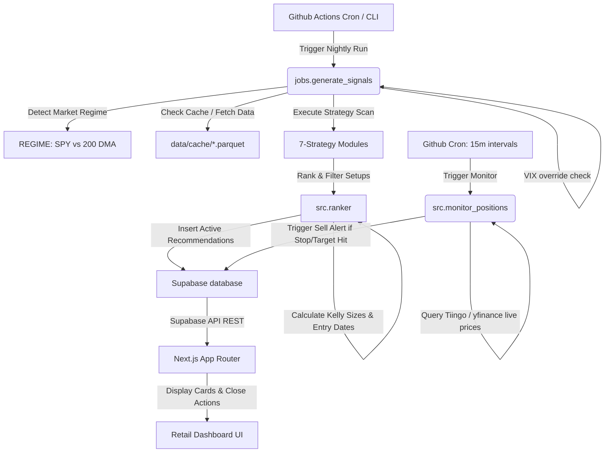

# Stock Recommendation Engine: Technical Documentation & Reference
**Strategy 1.3 Rev B (GTM Upgrades Edition)**

Welcome to the definitive reference documentation for the **Stock Recommendation Engine**—an automated, regime-aware, event-driven trade signal scanner, ranking system, and real-time portfolio monitor built for retail swing traders.

---

## 1. Executive Summary

- **What it is**: An automated, data-driven nightly signal scanner that fetches daily OHLCV prices, detects market regimes, filters setups through technical consensus gates, ranks candidates using a multi-factor Sigmoid model, and monitors active trades against stops/targets in real-time.
- **Value Proposition**: *"We scan 500+ stocks every night, select the top 1-5 setups, size them dynamically using Kelly criteria, and monitor them 24/7."* It removes emotional bias, enforces mathematical risk discipline, and automates sell signals.
- **Live Production URL**: [stock-recommendation-engine-rouge.vercel.app](https://stock-recommendation-engine-rouge.vercel.app)

---

## 2. The 7 Trading Strategies

The engine implements a diverse registry of 7 trading strategies, covering trend-following, mean-reversion, sector momentum, and event-driven signals.

| # | Strategy | Alpha Source | Market Condition | Exit Targets (T1/T2/T3) | Stop Loss Rule |
| :--- | :--- | :--- | :--- | :---: | :--- |
| **1** | Pullback Recovery | RSI dip in established uptrend | Bull with pauses | 7% / 12% / 18% | Swing Low in last 20 bars |
| **2** | Trend Following | Price > 50/200 DMA stack with momentum | Strong Bull | 12% / 22% / 35% | Volatility Stop: $\max(Low_{10},\, E - 2.5 \cdot ATR)$ |
| **3** | Mean Reversion | Oversold bounce (RSI < 35) at support | Corrections / Chop | 5% / 10% / 15% | Multi-day Swing Low |
| **4** | Sector Rotation | Relative Strength Index of Sector ETFs | Regime Shifts | 8% / 15% / 22% | 3% below 50 DMA |
| **5** | Post-Earnings Drift | Post-earnings gap-up + pullback support | All Regimes | 8% / 15% / 22% | $\max(50\_DMA \cdot 0.98,\, GapLow \cdot 1.02)$ |
| **6** | 52-Week High | Anchoring breakout anomaly near peaks | Strong Bull | 10% / 18% / 28% | $\max(50\_DMA \cdot 0.97,\, Peak \cdot 0.95)$ |
| **7** | Cross-Sectional Mom. | Outperforming peer universe (Top 15% 3M) | Bull Regimes | 10% / 18% / 25% | 50 DMA $\cdot$ 0.97 |

---

## 3. Mathematical Framework

The system replaces rigid parameter gates with continuous functions and probability-based risk modeling.

### 3.1 Market Regime Sensing & VIX Override
Market regime is evaluated using a $\pm2\%$ band around the 200-day simple moving average ($SMA_{200}$) of the SPY ETF:
Let $P_{SPY}$ be the latest SPY Close Price.
$$\Delta\% = \left(\frac{P_{SPY}}{SMA_{200}} - 1\right) \times 100$$

- **Bullish Regime ($\Delta\% > 2.0\%$)**: Enabled strategies: *Pullback Recovery, Trend Following, Sector Rotation, Post-Earnings Drift, 52-Week High, Cross-Sectional Momentum*.
- **Bearish Regime ($\Delta\% < -2.0\%$)**: Enabled strategies: *Mean Reversion, Post-Earnings Drift*.
- **Sideways Regime ($-2.0\% \le \Delta\% \le 2.0\%$)**: Enabled strategies: *Pullback Recovery, Mean Reversion, Sector Rotation, Post-Earnings Drift, Cross-Sectional Momentum*.

#### VIX Volatility Override:
If $VIX > 40$, the system enters emergency mode:
- Force regime to **Bearish**.
- Restrict strategies to **Mean Reversion** and **Post-Earnings Drift**.
- Set allocation sizing multiplier ($M_{vix}$) to **0.50**.

---

### 3.2 Volatility-Based Stops (ATR-14)
To dynamically adjust stops to stock volatility, we compute the Average True Range (ATR):
True Range ($TR$) is the maximum of:
$$TR = \max\left(H - L, |H - C_{prev}|, |L - C_{prev}|\right)$$
$$ATR_{14} = EMA(TR, 14)$$

For trend following setups, stop loss is assigned as:
$$StopLoss = \max\left(Low_{10}, EntryPrice - 2.5 \times ATR_{14}\right)$$

---

### 3.3 Multi-Indicator Consensus Gate
We replace rigid threshold gates with a continuous scoring helper evaluating 4 key technical dimensions:
1.  **RSI Score**: $S_{rsi} = 1.0 - \frac{|RSI - 55.0|}{35.0}$
2.  **ADX Score**: $S_{adx} = \min\left(1.0, \frac{ADX - 10.0}{25.0}\right)$
3.  **Volume Score**: $S_{vol} = \min\left(1.0, \frac{VolumeRatio - 0.5}{1.5}\right)$
4.  **DMA Score**: $S_{dma} = \min\left(1.0, \frac{Close / DMA_{50} - 0.95}{0.15}\right)$

The consensus gate passes if and only if:
$$\text{Average}(S_{rsi}, S_{adx}, S_{vol}, S_{dma}) > 0.65 \quad \text{and} \quad \sum \left(S_i > 0.5\right) \ge 3$$

---

### 3.4 Composite Score Formula
Signals are sorted using a linear combination of normalized metrics based on the active market regime:

$$\text{Composite Score} = w_{mom} \cdot S_{mom} + w_{exp} \cdot S_{exp} + w_{wr} \cdot S_{wr} + w_{reg} \cdot S_{reg} + w_{ctx} \cdot S_{ctx}$$

#### Regime-Dependent Weights ($w_i$):
| Regime | Technical Momentum ($w_{mom}$) | Backtest Expectancy ($w_{exp}$) | Win Rate ($w_{wr}$) | Regime Adjustment ($w_{reg}$) | Context Layer ($w_{ctx}$) |
| :--- | :---: | :---: | :---: | :---: | :---: |
| **Bullish** | 30% | 30% | 15% | 10% | 15% |
| **Sideways** | 25% | 35% | 15% | 10% | 15% |
| **Bearish** | 15% | 35% | 10% | 10% | 30% |

Each weight vector sums to exactly 1.0.

---

### 3.5 Regime-Aware Tier 1 Thresholds
Tier 1 (Strong Buy) classification thresholds are regime-dependent:
- **Bullish Regime**: $\text{Composite} \ge 80$
- **Sideways Regime**: $\text{Composite} \ge 75$
- **Bearish Regime**: $\text{Composite} \ge 75$ **and** Context Score ($S_{ctx}$) $> 50$

---

### 3.6 Drawdown Circuit Breaker & Kelly Capital Sizing
We size setups using a half-Kelly sizing model.
Let $P$ be the estimated win probability mapped from the candidate's composite score decile:
- $\text{Score} \ge 90 \rightarrow P = 0.75$
- $\text{Score} \ge 80 \rightarrow P = 0.68$
- $\text{Score} \ge 70 \rightarrow P = 0.60$
- $\text{Score} \ge 60 \rightarrow P = 0.52$
- $\text{Score} \ge 50 \rightarrow P = 0.45$
- $\text{Score} < 50 \rightarrow P = 0.35$

Let $R$ be the Weighted R/R ratio. The Kelly fraction $f^*$ is:
$$f^* = P - \frac{1 - P}{R}$$
$$\text{Half Kelly} = \frac{f^*}{2}$$

#### Drawdown Multiplier ($M_{dd}$):
We check equity drawdown ($DD$) against historical peak value:
$$DD = \frac{PeakValue - PortfolioValue}{PeakValue} \times 100$$
- **Normal ($DD < 5\%$)**: $M_{dd} = 1.00$
- **Warning ($5\% \le DD < 10\%$)**: $M_{dd} = 0.75$
- **Severe ($10\% \le DD < 15\%$)**: $M_{dd} = 0.50$ (requires setup score $\ge 80$)
- **Halt ($DD \ge 15\%$)**: $M_{dd} = 0.00$ (disables scanner signal insertion entirely)

The final allocation percentage is:
$$\text{Allocation \%} = \text{Half Kelly} \times M_{dd} \times M_{vix} \times 100$$
Where $M_{vix}$ is the VIX override multiplier (0.50 if VIX > 40, else 1.00).

$$\text{Max Shares} = \text{floor}\left(\frac{\text{Allocation \%} \times \$10,000}{\text{Entry Price} - \text{Stop Loss}}\right)$$

---

## 4. System Architecture & Workflow

The project is structured as a decoupled, serverless-friendly application.

### 1. Database Schema (`supabase/`)
- **`signals`**: Active positions table containing:
  - `entry_date` (computed as the next business trading day following the scan).
  - `exit_date` (set when position is marked closed).
  - `status` (defaults to `'open'`, set to `'closed'`).
  - `sell_signal` (Boolean flag set to `true` when target/stop hit).
  - `sell_signal_reason` (string details summarizing trigger details).
  - `sell_price` (price parameter registered on trigger).
  - Context breakdown columns (`context_analyst`, `context_earnings`, `context_news`, `context_fundamental`).
- **`portfolio_state`**: Tracks equity value, peak value, and current drawdown.
- **`recommendations`**: Client-facing view joining active `signals` with `ticker_metrics` backtest statistics.

### 2. Intraday Monitor (`src/monitor/`)
- **`monitor_positions.py`**: Executes on a cron scheduler every 15 minutes during US market hours (`*/15 13-20 * * 1-5` UTC). It fetches open database setups, downloads live prices via the Tiingo API (falling back to yfinance), and checks them against targets or stops. If hit, it updates `sell_signal` to `true`, `sell_signal_reason`, and `sell_price`.

### 3. Backend close endpoint (`app/api/positions/close/route.ts`)
- Processes App Router POST requests. When the user clicks "Mark Closed":
  1. Computes total holding days and trade return percentages.
  2. Updates `signals_history` outcome to `'closed'` with the computed return and holding days.
  3. Updates the active `signals` table record to `status = 'closed'` and `sell_signal = false`.

### 4. Interactive Frontend Dashboard (`frontend/`)
- Displays simplified dashboard tables detailing entry dates, days held, current prices, P&L percentages, status badges, and inline red warning triggers.
- Clickable rows expand to display the 4-part context score breakdown (Analyst, Earnings, News Sentiment, Fundamentals) and the "Mark Closed" action button.
