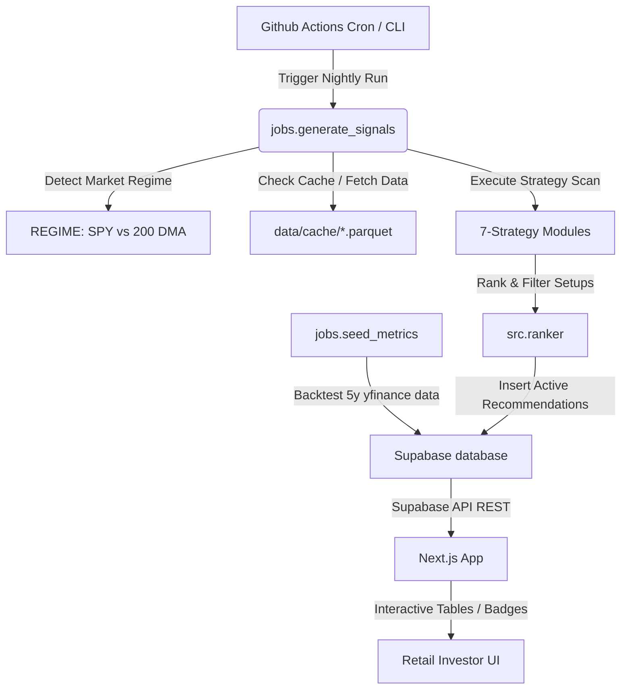

# Stock Recommendation Engine: Technical Documentation & Reference

Welcome to the definitive reference documentation for the **Stock Recommendation Engine** project—an automated, regime-aware, event-driven trade signal scanner and ranking system built for retail investors.

---

## 1. Executive Summary

*   **What it is**: An automated, data-driven nightly signal scanner that fetches daily OHLCV prices, calculates indicators, runs historical backtests, scores setups using a multi-factor model, and generates high-confidence stock recommendations.
*   **Target Audience**: Individual and retail investors seeking disciplined, rule-based, and mathematically backtested swing trading setups.
*   **Core Value Proposition**: *"We scan 500+ stocks every night and show you only the best 1-5 setups."* It filters out market noise, restricts risk, dynamically shifts strategies based on market conditions, and highlights high-probability setups.
*   **Live Application URL**: [https://stock-recommendation-engine-rouge.vercel.app](https://stock-recommendation-engine-rouge.vercel.app)

---

## 2. The 7 Strategies (Complete Map)

The engine implements a diverse registry of 7 trading strategies, covering trend-following, mean-reversion, sector momentum, and event-driven signals.

| # | Strategy | Alpha Source | Market Condition | Status | Exit Targets (T1/T2/T3) | Stop Loss Rule |
| :--- | :--- | :--- | :--- | :--- | :---: | :--- |
| **1** | Pullback Recovery | RSI dip in established uptrend | Bull with pauses | **Live** | 5% / 10% / 16% | Swing Low in last 20 bars |
| **2** | Trend Following | Price > 50/200 DMA stack with momentum | Strong Bull | **Live** | 20% / 35% / 50% | Trailing Stop (EMA-based) |
| **3** | Mean Reversion | Oversold bounce (RSI < 35) at support | Corrections / Chop | **Live** | 8% / 15% / 25% | Multi-day Swing Low |
| **4** | Sector Rotation | Relative Strength Index of Sector ETFs | Regime Shifts | **Live** | 10% / 18% / 25% | 3% below 50 DMA |
| **5** | Post-Earnings Drift | Post-earnings gap-up + pullback support | All Regimes | **Live** | 8% / 15% / 25% | Max(50 DMA * 0.98, Gap Low * 1.02) |
| **6** | 52-Week High | Anchoring breakout anomaly near 1-yr peaks | Strong Bull | **Live** | 12% / 20% / 30% | Max(50 DMA * 0.97, 52w High * 0.95) |
| **7** | Cross-Sectional Mom. | Outperforming peer universe (Top 15% 3M) | Bull Regimes | **Live** | 10% / 18% / 25% | 50 DMA * 0.97 |

---

### Strategy Deep-Dives

#### 1. Pullback Recovery
*   **Core Hypothesis**: In an established primary uptrend, brief pullbacks driven by short-term profit-taking represent low-risk entry points. Once the pullback exhausts (marked by RSI recovery), the stock resumes its trend.
*   **Entry Criteria**:
    *   `Price > 50 DMA > 200 DMA` (Trend stack)
    *   `Min(RSI_14) in last 10 days < 50` (Pullback occurred - relaxed from 45 in Rev B patch)
    *   `45 <= Current RSI_14 <= 65` (RSI is recovering)
    *   `Volume > 20-day Average Volume` (Buying volume confirmation)
*   **Exit Plan**:
    *   Stop Loss: Swing low in the last 20 trading days.
    *   Targets: Entry +5% (T1), +10% (T2), +16% (T3).
*   **Holding Period**: 5 to 15 trading days.
*   **Failure Modes**: Market-wide selloffs that break support levels; fake breakouts where the stock stalls at the previous swing high.

#### 2. Trend Following
*   **Core Hypothesis**: Markets trend over long periods. Buying stocks showing structural breakout strength and trailing stops allows participation in large, persistent upward trends.
*   **Entry Criteria**:
    *   `Price > 50 DMA > 200 DMA`
    *   `RSI_14 >= 58` (Strong momentum)
    *   `ADX_14 >= 22` (Strong trend strength)
    *   `Volume > 20-day Average Volume`
*   **Exit Plan**:
    *   Stop Loss: Set dynamically via trailing stop loss using 20-period EMA.
    *   Targets: Entry +20% (T1), +35% (T2), +50% (T3).
*   **Holding Period**: 3 to 12 weeks.
*   **Failure Modes**: Sudden mean-reversion spikes; choppy, sideways markets causing multiple consecutive stop-outs.

#### 3. Mean Reversion
*   **Core Hypothesis**: Asset prices are anchored. Deeply oversold stocks near historical support levels tend to bounce back to their short-term averages as selling pressure exhausts.
*   **Entry Criteria**:
    *   `Current RSI_14 < 35` and `Min(RSI_14) in last 5 days < 30` (Extremely oversold)
    *   `Price within 5% of 20-day Low` (At support)
    *   `Volume >= 1.0x 20-day Average` (Liquidity confirmation)
    *   `ADX_14 <= 30` (Avoids high-momentum cascades/falling knives)
    *   `Price <= Lower Bollinger Band (Width position <= 0.25)`
*   **Exit Plan**:
    *   Stop Loss: 2% below the recent 20-day swing low.
    *   Targets: Entry +8% (T1), +15% (T2), +25% (T3).
*   **Holding Period**: 3 to 10 trading days.
*   **Failure Modes**: Buying into structural bankruptcy/liquidation; catching falling knives in major bear markets.

#### 4. Sector Rotation
*   **Core Hypothesis**: Institutional capital flows sequentially between sectors. Scanning Sector ETFs reveals macro sector leadership, providing beta outperformance with lower single-stock risk.
*   **Entry Criteria (Scanned on Sector ETFs only)**:
    *   `Price > 50 DMA` and `Price > 200 DMA`
    *   `55 <= RSI_14 <= 75` (Trending without exhaustion)
    *   `ADX_14 >= 18` (Clear structural trend)
    *   `Volume >= 1.0x 20-day Average`
    *   `Price within 3% of 20-day High` (Relative strength leader)
*   **Exit Plan**:
    *   Stop Loss: 3% below the 50-day moving average.
    *   Targets: Entry +10% (T1), +18% (T2), +25% (T3).
*   **Holding Period**: 2 to 6 weeks.
*   **Failure Modes**: False sector breakouts; sector rotations reversing instantly due to sudden macroeconomic shifts (e.g., interest rate announcements).

#### 5. Post-Earnings Drift (PEAD)
*   **Core Hypothesis**: Earnings announcements trigger structural repricing. Strong positive surprises generate large gaps that institutional buyers accumulate into over the subsequent weeks, creating a post-earnings drift.
*   **Entry Criteria**:
    *   `Last Earnings Date within 1-5 days` (Recent event)
    *   `Earnings Gap-Up >= 5%` (Significant positive reaction)
    *   `Price holds >= 50% of the initial gap range` (No fake-outs/fading)
    *   `Price within 3% of the gap high` (Entering on first consolidative pullback)
    *   `Price > 50 DMA` (Long-term uptrend support)
    *   `Earnings Volume >= 2.0x 20-day Average Volume` (Institutional volume)
    *   `ADX_14 >= 15` (Trend intact)
*   **Exit Plan**:
    *   Stop Loss: `Max(50 DMA * 0.98, Gap Low * 1.02)` (Exit if gap low is violated).
    *   Targets: Entry +8% (T1), +15% (T2), +25% (T3).
*   **Holding Period**: 2 to 4 weeks.
*   **Failure Modes**: Earnings "gap and fade" setups where retail hype collapses; overall market corrections dragging down the gap-up.

#### 6. 52-Week High Breakout
*   **Core Hypothesis**: The "anchoring anomaly" describes retail investors' reluctance to buy stocks at multi-month highs. Because of this, breakouts past 52-week highs are structurally underpriced, offering strong upward momentum as the stock enters price discovery.
*   **Entry Criteria**:
    *   `Price within 2% of 52-Week High`
    *   `Price > 50 DMA`
    *   `55 <= RSI_14 <= 75` (Active buying but not overbought)
    *   `ADX_14 >= 20` (Strong underlying trend)
    *   `Volume >= 1.2x 20-day Average` (Breakout volume confirmation)
    *   `Price within 3% of 20-day High`
*   **Exit Plan**:
    *   Stop Loss: `Max(50 DMA * 0.97, 52w High * 0.95)`.
    *   Targets: Entry +12% (T1), +20% (T2), +30% (T3).
*   **Holding Period**: 3 to 6 weeks.
*   **Failure Modes**: Double top formations; market exhaustion leading to failed breakouts.

#### 7. Cross-Sectional Momentum
*   **Core Hypothesis**: Relative strength is persistent. Buying the top 15% outperforming stocks over a 3-month window provides a structural edge because high relative momentum tends to persist over the medium term.
*   **Entry Criteria**:
    *   `Stock is in the Top 15% of the S&P 500 / Nasdaq-100 by 3-Month returns` (Pre-screen)
    *   `Price > 50 DMA`
    *   `50 <= RSI_14 <= 70`
    *   `ADX_14 >= 15`
    *   `Volume >= 1.0x 20-day Average`
    *   `3-Month Return > 0`
*   **Exit Plan**:
    *   Stop Loss: `50 DMA * 0.97`.
    *   Targets: Entry +10% (T1), +18% (T2), +25% (T3).
*   **Holding Period**: Rebalanced weekly; hold 2 to 6 weeks.
*   **Failure Modes**: Extreme market sector rotation away from high-beta momentum to low-beta defensives; momentum crashes.

---

## 3. The Math

The system uses a mathematical ranking model to evaluate, rank, and filter qualified setups.

### Composite Score Formula
The composite score evaluating each trading setup is defined by the weighted sum:

$$Composite\_Score = 0.30 \times Momentum + 0.40 \times Expectancy + 0.20 \times WinRate + 0.10 \times Regime$$

Where each sub-score is normalized to a $[0, 100]$ range:

1.  **Technical Momentum ($30\%$ weight)**:
    Let $S_{RSI}$, $S_{Prox}$, $S_{Vol}$, and $S_{MACD}$ be the sub-scores for RSI, 50 DMA proximity, volume ratio, and MACD histogram respectively:
    *   $S_{RSI} = 100 - |RSI_{14} - 50| \times 4.0$, clipped to $[0, 100]$.
    *   $S_{Prox} = 100 - \left|\frac{Price}{50\_DMA} - 1.0\right| \times 500.0$, clipped to $[0, 100]$.
    *   $S_{Vol} = Volume\_Ratio \times 50.0$, clipped to $[0, 100]$.
    *   $S_{MACD} = 50.0 + MACD\_Histogram \times 200.0$, clipped to $[0, 100]$.

    The raw momentum is:
    $$Raw\_Momentum = \frac{S_{RSI} + S_{Prox} + S_{Vol} + S_{MACD}}{4.0}$$
    
    If $Raw\_Momentum < 55.0$, the final $Momentum$ score is set to $0.0$. Otherwise, it is normalized to its percentile rank relative to the active candidate pool.

2.  **Risk-Adjusted Expectancy ($40\%$ weight)**:
    Let $X$ be the stock's backtested expectancy percentage over 5 years. We calculate its $Z$-score within the active candidate pool:
    $$Z = \frac{X - \mu_{pool}}{\sigma_{pool}}$$
    We then map the $Z$-score to a $[0, 100]$ scale using a Sigmoid function:
    $$Sigmoid\_Score = \frac{100.0}{1.0 + e^{-Z}}$$
    If $X < 0.0$ (negative expectancy), we apply a negative expectancy penalty:
    $$Expectancy\_Score = \max(5.0,\, Sigmoid\_Score - 30.0)$$

3.  **Historical Win Rate ($20\%$ weight)**:
    Normalized percentile rank of the stock's backtested 5-year win rate compared to the active candidate pool.

4.  **Regime Adjustment ($10\%$ weight)**:
    *   **Bull Regime**: $100.0$ if $50.0 \le RSI_{14} \le 70.0$ AND $Price > 50\_DMA$, else $0.0$.
    *   **Bear Regime**: $100.0$ if the stock belongs to a defensive sector (Utilities, Staples, Health Care, Telecom, Insurance) OR its Beta is $< 1.0$, else $0.0$.
    *   **Sideways/Chop Regime**: $100.0$ if $|RSI_{14} - 50.0| < 8.0$, else $0.0$.

---

### Absolute Composite Floor
To prevent high-momentum but structurally losing assets from passing through the scanner, any candidate with:
*   $Expectancy < 0.0\%$ **AND**
*   $Win\_Rate < 25.0\%$

will have its final $Composite\_Score$ capped at an absolute ceiling of $40.0$, rendering it ineligible for the `Buy` or `Strong Buy` recommendation tiers.

---

### Quality Score Adjustment
If a candidate violates any risk guardrails (such as sample size $< 5$, win rate $< 50\%$, or expectancy $< 1.0\%$), its tier label is marked as `Blocked`. To preserve its location in the database while warning users, its displayed $Quality\_Score$ is penalized:
$$Quality\_Score = \begin{cases} Composite\_Score \times 0.8 & \text{if Blocked} \\ Composite\_Score & \text{otherwise} \end{cases}$$

---

### Backtest Performance Metrics Formulas

The metrics seeded in the database are calculated over a **5-year lookback window** (approx. 1,260 trading bars):

1.  **Trade Return Percentage ($R_{pct}$)**:
    Each simulated trade is entered at max(Entry Price, Day Open) and exited at target/stop (including overnight gaps) with a $0.10\%$ round-trip transaction cost:
    $$R_{pct} = \left(\frac{Exit\_Price - Entry\_Price}{Entry\_Price}\right) \times 100.0 - 0.10\%$$

2.  **Expectancy Percentage ($Expectancy_{pct}$)**:
    The mathematical expectation of the returns of the backtested trades:
    $$Expectancy_{pct} = \frac{1}{N} \sum_{i=1}^{N} R_{pct, i}$$

3.  **Win Rate ($WR_{pct}$)**:
    $$WR_{pct} = \left(\frac{Wins}{Wins + Losses}\right) \times 100.0$$

---

## 4. System Architecture

The project is structured as a decoupled, serverless-friendly application.

### 1. Backend Scanner & Orchestrator (`jobs/`)
*   **`generate_signals.py`**: The main execution orchestrator. Runs every night. It:
    1.  Downloads SPY data to determine the market regime ($Regime = Bull$ if $SPY\_Close > 200\_DMA$).
    2.  Pulls the stock constituent list (S&P 500 + Nasdaq-100) and Sector ETFs.
    3.  Checks the local Parquet cache (`data/cache/`) to download missing or stale price data from yfinance.
    4.  Runs active strategies according to the detected regime.
    5.  Ranks the signals and computes target prices (`target_1_price`, `target_2_price`, `target_3_price`) dynamically at insert time.
    6.  Archives old recommendations to `signals_history` (carrying forward strategy name and target prices, setting `outcome = 'open'`), clears the active recommendations, and inserts new ones.
*   **`validate_ranking.py`**: Runs automatically every night after signal generation. It evaluates open history rows where `scan_date` is $\ge 10$ business days ago, downloading subsequent OHLCV price history from yfinance to identify outcome resolutions:
    *   `stopped`: Low price hits stop loss first (priority exit).
    *   `hit_t3` / `hit_t2` / `hit_t1`: High price hits target price levels (T3 $\rightarrow$ T2 $\rightarrow$ T1 priority).
    *   `expired`: Holds past 20 trading days without stop or target hits (closed at close price).
    *   Updates the record in `signals_history` with outcome status, return percentage, outcome date, and holding days.
*   **`seed_metrics.py`**: Runs a full 5-year historical backtest for all 514 tickers to calculate win rates, expectancy, trade count, and median holding days, then seeds them into the database.
*   **`strategies/`**: Folder containing self-contained strategy classes implementing `StrategyInterface` (defining specific scan logic, entry/exit math, and custom narratives).

### 2. Frontend Application (`frontend/`)
*   **Tech Stack**: Next.js (App Router), React, TailwindCSS, TypeScript.
*   **Features**:
    *   Interactive `recommendations-table.tsx` with dynamic sorting, filtering, and row expansion.
    *   Regime Banner showing the current market regime and the number of active strategies.
    *   Strategy Badge rendering utilizing specific Tailwind colors (e.g., Teal for Sector Rotation, Rose for PEAD, Emerald for Cross-Sectional Momentum).
    *   Detail expansion cards explaining stop-loss, target exits, holding periods, and specific risk warnings.

---

## 5. Honest Flaws & Shortcomings

No trading system is perfect. Here are the documented limitations of the Stock Recommendation Engine:

1.  **yfinance Rate Limits**: The scraper is dependent on yfinance. Although a local Parquet cache is implemented to minimize downloads, full re-seeding runs can occasionally trigger temporary IP rate limits if run sequentially without delays.
2.  **Lookback Overfitting**: The backtest metrics (`win_rate`, `expectancy_pct`) are based on historical Strategy 1.1 parameters. If market dynamics change permanently (e.g., long-term regime shifts), past performance metrics may overfit and fail to reflect future probability distributions.
3.  **Earnings Date Availability**: The PEAD strategy fetches the last earnings date dynamically via yfinance. Sometimes, yfinance does not return historical earnings indexes for newer or restructured stocks, which leads to those tickers being skipped.
4.  **No Shorting / Options Support**: The engine is purely long-only. In severe bear markets (where only 2 strategies are active), the system generates very few recommendations. There is currently no support for short setups, put options, or inverse ETFs.
5.  **Database Seeding Time**: Backtesting 5 years of daily data for 514 tickers takes approximately 8-10 minutes. While highly optimized, it cannot be run instantly on demand in a serverless environment and is best suited for scheduled cron jobs.
