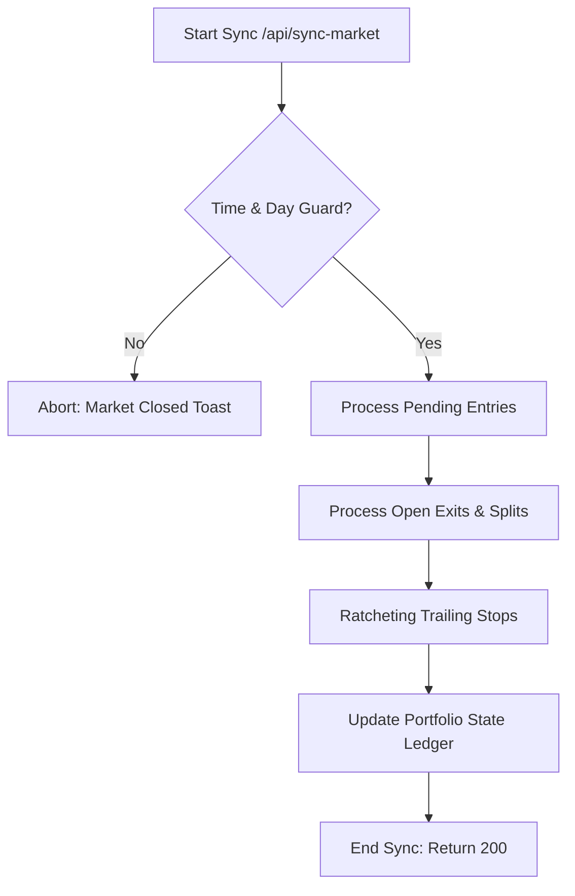

# Stock Recommendation Engine: Complete System Manual

This document provides a comprehensive technical overview of the Stock Recommendation Engine. It describes the full-stack architecture, database schemas, execution pipelines, math/sizing formulas, and scheduling systems. It is structured to serve as a complete reference manual for developer agents (LLMs) or human engineers working on the system.

---

## 1. System Philosophy & Purpose
The **Stock Recommendation Engine** is an automated screener, ranking system, and trade-tracking ledger for equity traders. 
* **No Broker Routing**: The system does **not** execute live buy/sell orders via a broker. 
* **Trader Dashboard**: It serves as a decision-support dashboard. "Executing" a trade means updating the status in the Supabase database (e.g., from `open` to `closed` or `cancelled`), which reflects on the React dashboard.
* **Morning Gap & Split Protection**: The system features strict risk guards to prevent buying stock at slippage-ruined entry prices (Gap Tolerance Gate) and to handle stock splits without triggering false stop losses.

---

## 2. Full-Stack System Architecture

```mermaid
graph TD
    subgraph GitHub Workflows (Crons)
        A[Nightly Scan Workflows] -->|generate_signals.py| C[(Supabase DB)]
        B[Intraday Monitor Workflows] -->|requests POST| D[Next.js API: /api/sync-market]
    end

    subgraph Next.js Frontend (Server & Client)
        D -->|market-evaluator.ts| C
        E[User UI Dashboard] -->|loads view| F[recommendations view]
        E -->|Manual Refresh| D
        F -->|Selects UNION| C
    end

    subgraph Data Sources
        D -->|Quotes| G[Tiingo / Finnhub API]
        D -->|Splits| H[Yahoo Finance API]
        A -->|Daily bars| I[yfinance / News]
    end
```

---

## 3. Database Schema & View Structure

The database resides in Supabase (PostgreSQL). The tables and view definitions are outlined below.

### 3.1. `signals` Table
Represents active portfolio holdings and new recommendations awaiting market open.
* `id` (int8, Primary Key)
* `scan_date` (date): The night the signal was generated.
* `ticker` (varchar(10)): Stock symbol.
* `company_name` (varchar(150))
* `industry` (varchar(100))
* `price` (numeric(10,2)): Current price.
* `entry_price` (numeric(10,2)): Estimated entry price or actual open execution price.
* `stop_loss` (numeric(10,2)): Trailing stop or static stop loss price.
* `exit_price` (numeric(10,2)): Price at which the position was closed.
* `status` (text): State of the signal. Valid values: `pending`, `open`, `closed`, `cancelled_gap_up`, `cancelled_gap_down`.
* `entry_date` (date): The target entry date (usually the trading day after `scan_date`).
* `exit_date` (date): Date the position was closed.
* `sell_signal` (boolean): Flag indicating exit triggers were breached.
* `sell_signal_reason` (text): Description of the exit breach (e.g., `"Stop loss hit"`).
* `sell_price` (numeric): Final sell execution price.
* `position_sizing` (varchar(30)): Display size string (e.g., `"K: 11.2%"`).
* `allocated_dollars` (numeric(10,2)): Total dollar size allocated to this position.
* `max_shares` (integer): Maximum share sizing allowed based on capital risk.
* **Context Sub-scores**: `context_analyst` (numeric), `context_earnings` (numeric), `context_news` (numeric), `context_fundamental` (numeric).

### 3.2. `signals_history` Table
A permanent, duplicate-safe ledger of all signals. Rows are matched uniquely by `on_conflict(scan_date, ticker)`.
* It shares columns with `signals` but maps the final status to `outcome` (e.g. `open`, `stopped`, `hit_t1`, `hit_t2`, `hit_t3`, `cancelled_gap_up`, `cancelled_gap_down`).
* `outcome_date` (date): The date the trade ended.
* `outcome_return_pct` (numeric): Percentage gain/loss of the trade.
* `outcome_holding_days` (integer): Total calendar days between entry and exit.

### 3.3. `portfolio_state` Table
Logs historical equity curves and peak values to enforce drawdown risk gates.
* `id` (int8, Primary Key)
* `date` (date)
* `portfolio_value` (numeric(12,2)): Equity balance (realized + unrealized). Starts at `$10,000`.
* `peak_value` (numeric(12,2)): Highest equity value reached (used to compute high-watermark drawdown).
* `current_drawdown_pct` (numeric(5,2)): Percent peak-to-trough decline.

### 3.4. `recommendations` View (UNION View)
Provides the unified data feed for the UI dashboard. It combines active records from `signals` and archived histories from `signals_history` to show both active holdings and closed histories.
```sql
CREATE OR REPLACE VIEW recommendations AS
WITH unified_signals AS (
  SELECT
    s.scan_date, s.ticker, s.company_name, s.industry, s.price, s.entry_price, s.stop_loss, s.exit_price,
    s.upside_pct, s.risk_reward, s.target_1, s.target_2, s.target_3, s.target_1_pct, s.target_2_pct, s.target_3_pct,
    s.weighted_rr, s.position_sizing, s.narrative, s.tier_label, s.is_fallback, s.current_rsi, s.volume_ratio,
    s.adx_value, s.macd_histogram, s.rsi_min_10d, s.ema20, s.score, s.composite_score, s.quality_score,
    s.strategy, s.strategy_name, s.regime, s.context_score, s.is_momentum_exception, s.distance_from_high_pct,
    s.entry_date, s.exit_date, s.status, s.sell_signal, s.sell_signal_reason, s.sell_price,
    s.context_analyst, s.context_earnings, s.context_news, s.context_fundamental, s.allocated_dollars, s.max_shares
  FROM signals s
  UNION ALL
  SELECT
    h.scan_date, h.ticker, h.company_name, h.industry, h.price, h.entry_price, h.stop_loss, h.exit_price,
    h.upside_pct, h.risk_reward, h.target_1, h.target_2, h.target_3, h.target_1_pct, h.target_2_pct, h.target_3_pct,
    h.weighted_rr, h.position_sizing, h.narrative, h.tier_label, h.is_fallback, h.current_rsi, h.volume_ratio,
    h.adx_value, h.macd_histogram, h.rsi_min_10d, h.ema20, h.score, h.composite_score, h.quality_score,
    h.strategy, h.strategy_name, h.regime, h.context_score, h.is_momentum_exception, h.distance_from_high_pct,
    h.scan_date AS entry_date, h.outcome_date AS exit_date,
    CASE 
      WHEN h.outcome = 'open' THEN 'open'
      WHEN h.outcome IN ('stopped', 'stop_loss', 'hit_t3', 'hit_t2', 'hit_t1', 'closed') THEN 'closed'
      ELSE h.outcome
    END AS status,
    TRUE AS sell_signal,
    CASE 
      WHEN h.outcome = 'stopped' THEN 'Stop loss hit'
      WHEN h.outcome = 'hit_t3' THEN 'Target 3 hit – full exit'
      WHEN h.outcome = 'hit_t2' THEN 'Target 2 hit – sell 30%'
      WHEN h.outcome = 'hit_t1' THEN 'Target 1 hit – sell 50%'
      ELSE 'Closed'
    END AS sell_signal_reason,
    h.exit_price AS sell_price,
    0.0 AS context_analyst, 0.0 AS context_earnings, 0.0 AS context_news, 0.0 AS context_fundamental,
    h.allocated_dollars, h.max_shares
  FROM signals_history h
  WHERE h.outcome != 'open'
)
SELECT u.*, 
       COALESCE(m.win_rate, 0) AS past_win_rate, 
       COALESCE(m.wins + m.losses, 0) AS total_trades, 
       COALESCE(m.expectancy_pct, 0) AS expectancy_pct
FROM unified_signals u
LEFT JOIN ticker_metrics m ON u.ticker = m.ticker;
```

---

## 4. Execution Pipelines & Logic

### 4.1. Nightly Scanner Pipeline (`jobs/generate_signals.py`)
Runs at 8:00 PM ET on trading days to find and grade setups.
1. **Regime Decoding**: Calls the HMM model to detect the current market regime (`bull`, `bear`, or `sideways`).
2. **Equity Drawdown Check**: Queries `portfolio_state` to get the latest drawdown percentage. Maps it to a risk tier multiplier:
   * Drawdown $\le 5\%$: Multiplier = $1.0$ (Normal risk)
   * $5\% < \text{Drawdown} \le 10\%$: Multiplier = $0.75$ (Conservative)
   * $10\% < \text{Drawdown} \le 15\%$: Multiplier = $0.50$ (Risk reduction)
   * Drawdown $> 15\%$: Multiplier = $0.00$ (Stop-out, cash-only mode)
3. **Emergency Override**: If VIX > 40, forces the market regime to `bear` and applies an additional size multiplier of $0.5$.
4. **Grading & Selection**: Canditates are scored based on Momentum, Expectancy, Winrate, Regime-adjustment, and Context (NLP sentiment + analyst scores).
5. **Tier Labeling**:
   * *Strong Buy (Tier 1)*: Passing score threshold ($80$ in Bull, $75$ in Sideways/Bear), positive expectancy, win rate $\ge 35\%$, and history $\ge 10$ trades. (In Bear, context score must also be $>50$).
   * *Buy (Tier 2)*: Composite score $\ge 50$, expectancy $\ge 0\%$, win rate $\ge 25\%$.
   * Watch (Tier 3) and Speculative (Tier 4) are discarded.
6. **Cash-Constrained Normalized Sizing**: Fits the raw Kelly allocations of the new buy signals to available cash (total portfolio value minus current open holdings). Calculates share sizing and inserts them as `status = 'pending'` into the database.

---

### 4.2. Intraday Monitor API (`frontend/src/lib/market-evaluator.ts`)
Exposes the `/api/sync-market` endpoint, which is triggered every 15 minutes by a cron job or a manual UI button. It processes checks sequentially:



#### Step 1: Market Hours & Holiday Guard
Checks if the current NY Time is within Standard + Extended trading hours (Monday through Friday, 4:00 AM to 8:00 PM ET). Aborts execution outside this window to save API rate limits.

#### Step 2: Morning Open Gap Gate (Pending Signals)
Runs at market open to inspect setups inserted as `pending` by the nightly scanner.
1. Fetches the morning opening price from Tiingo (falls back to Finnhub quote API).
2. Calculates opening entry slippage: 
   $$\text{Gap \%} = \frac{\text{Open Price} - \text{Reference Entry}}{\text{Reference Entry}} \times 100$$
3. **Exiting/Cancelling Gates**:
   * If $\text{Gap \%} > 2.0\%$: The risk/reward ratio is ruined. Cancels setup immediately: `status = 'cancelled_gap_up'`, `sell_signal = true`.
   * If $\text{Open Price} \le \text{Stop Loss}$: The stock gapped down beyond the exit. Cancels setup immediately: `status = 'cancelled_gap_down'`, `sell_signal = true`.
   * Else: The gate is passed. Updates the stock's actual cost basis (`entry_price = Open Price`) and transitions the trade to active: `status = 'open'`.

#### Step 3: Stock Split Corporate Actions Handler
Checks if an active holding underwent a split overnight to prevent mathematical stop breaches.
1. Queries Yahoo Finance split endpoints.
2. If a split occurred today (e.g. 2:1 split, ratio = 2.0), the system adjusts the parameters proportionally:
   $$\text{New Entry Price} = \frac{\text{Old Entry}}{\text{Ratio}}$$
   $$\text{New Stop Loss} = \frac{\text{Old Stop}}{\text{Ratio}}$$
   $$\text{New Target Price} = \frac{\text{Old Target}}{\text{Ratio}}$$
   $$\text{New Shares} = \text{Old Shares} \times \text{Ratio}$$
3. Appends a stateless flag to the record's narrative: `[SPLIT_ADJUSTED_YYYY-MM-DD]` to guarantee split adjustments are idempotent and run exactly once.

#### Step 4: Targets & Stop Loss Exits
Calculates exit breaches sequentially using real-time price updates:
* **Category A: Targets-based scale-outs** (for short-term setups):
  * **Target 3 Breach**: Full exit. Sets `status = 'closed'`, `sell_signal = true`, `sell_signal_reason = 'Target 3 hit'`.
  * **Target 2 Breach**: Sell 30% of position. Sets `sell_signal_reason = 'Target 2 hit'`.
  * **Target 1 Breach**: Sell 50% of position. Sets `sell_signal_reason = 'Target 1 hit'` and **moves the Stop Loss to breakeven** (`stop_loss = entry_price`) to protect the trade.
  * **Stop Loss Breach**: Full exit. Sets `status = 'closed'`, `sell_signal = true`, `sell_signal_reason = 'Stop loss hit'`.
* **Category B: Trailing Stop only** (for trend/momentum setups):
  * **Stop Loss Breach**: Full exit. Sets `status = 'closed'`, `sell_signal = true`, `sell_signal_reason = 'Trailing stop hit'`.

#### Step 5: Wilder's ATR Stop Ratcheting
For active trend setups, the stop loss is dynamic. It fetches the past 14 daily price bars to calculate Average True Range (ATR):
* **ATR Wilder Calculation**:
  $$\text{TR} = \max(\text{High} - \text{Low}, \lvert\text{High} - \text{Prev Close}\rvert, \lvert\text{Low} - \text{Prev Close}\rvert)$$
  $$\text{ATR}_t = \frac{\text{ATR}_{t-1} \times 13 + \text{TR}_t}{14}$$
* **Ratcheting stop rule**: If $\text{Price} - 3.0 \times \text{ATR} > \text{Stop Loss}$, updates stop loss to this higher price. The stop loss can only move up, never down.

---

## 5. Mathematical Formulas & Rules

### 5.1. Regime-Dependent Composite Score Weights
Composite scores are weighted dynamically based on the active market regime:
| Weight Component | Bull Regime | Sideways Regime | Bear Regime |
| :--- | :--- | :--- | :--- |
| **Technical Momentum** | 30% ($0.30$) | 25% ($0.25$) | 15% ($0.15$) |
| **Expectancy** | 30% ($0.30$) | 35% ($0.35$) | 35% ($0.35$) |
| **Historical Win Rate** | 15% ($0.15$) | 15% ($0.15$) | 10% ($0.10$) |
| **Regime Adjustment** | 10% ($0.10$) | 10% ($0.10$) | 10% ($0.10$) |
| **Context (NLP)** | 15% ($0.15$) | 15% ($0.15$) | 30% ($0.30$) |

---

### 5.2. Position Sizing Equations

#### Half-Kelly Allocation Size
Calculates the raw un-normalized portfolio allocation fraction for a candidate:
$$\text{Kelly Fraction} = \text{Win Rate} - \frac{1.0 - \text{Win Rate}}{\text{Risk/Reward}}$$
$$\text{Half-Kelly Fraction} = \max\left(0.0, \frac{\text{Kelly Fraction}}{2.0}\right)$$
$$\text{Raw Dollar Sizing} = \text{Portfolio Value} \times \text{Half-Kelly Fraction} \times \text{Drawdown Multiplier} \times \text{VIX Multiplier}$$

#### Cash-Constrained Normalization
Ensures the total dollar commitments of the new scan recommendations fit within available cash:
$$\text{Total Capital Needed} = \sum \text{Raw Dollar Sizing}$$
$$\text{Multiplier} = \begin{cases} 
      \frac{\text{Available Cash}}{\text{Total Capital Needed}} & \text{if } \text{Total Capital Needed} > \text{Available Cash} \\
      1.0 & \text{otherwise}
   \end{cases}$$
$$\text{Final Dollar Allocation} = \text{Raw Dollar Sizing} \times \text{Multiplier}$$
$$\text{Max Shares} = \lfloor \frac{\text{Final Dollar Allocation}}{\text{Entry Price} - \text{Stop Loss}} \rfloor$$

---

## 6. Schedulers & Timing Configuration

The system uses GitHub Actions workflows for scheduling jobs.

### 6.1. Nightly Scanner Cron (`nightly_scan.yml`)
* **Cron Expression**: `0 1 * * 2-6` (Runs Tuesday through Saturday at 01:00 UTC, which corresponds to Monday-Friday at 8:00 PM EST / 9:00 PM EDT).
* **Guards**: Only runs 1-2 hours after daily EOD data finishes settling. Does not run on weekends.

### 6.2. Intraday Monitor Cron (`monitor.yml`)
* **Cron Expression**: `*/15 * * * 1-5` (Runs every 15 minutes, Monday through Friday).
* **Guards**: It triggers a POST request to `/api/sync-market`. If the current Eastern time falls outside the 4:00 AM to 8:00 PM window (standard + extended trading hours) or is on a US market holiday, the API blocks queries and returns `403` to save credit rate limits.

---

## 7. Frontend Dashboard Features

The Next.js React frontend dashboard provides the following features:
* **Starting Principal Card**: Locked at `$10,000` starting principal. Computes net P&L and All-Time returns dynamically on the client:
  $$\text{Portfolio Value} = \$10,000 + \text{Realized P&L} + \text{Unrealized P&L}$$
* **Tabbed Navigation**: Splits data into an **Active Positions** tab (which queries database records in `open`/`pending` status) and a **Closed History** tab (which displays closed/stopped/cancelled trades).
* **Embedded Charts**: Clicking any row expands details and embeds an interactive TradingView widget showing daily price movements with SMA and index parameters.
* **Sync Button**: Features a "Sync Live Market" button. Upon clicking, it makes a POST request to `/api/sync-market` to execute the evaluation loop and shows the last synced timestamp in Eastern Time (e.g. `11:05:17 ET`).
