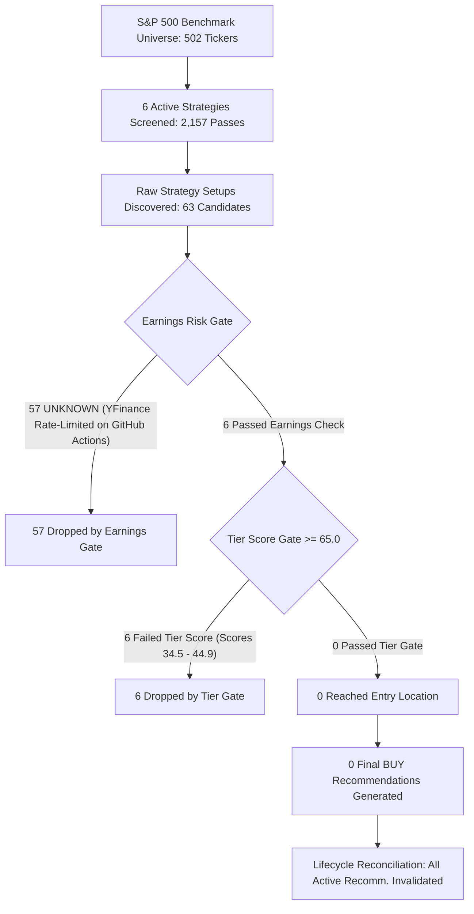

# Diagnostic Audit: Oct 3, 2026 Zero-Recommendation Nightly Scan

**Repository**: `vishalrana/stock-recommendation-engine`  
**Scan Timestamp**: 2026-10-03T02:20:31Z (GitHub Actions Run `37089184728`, Job `111105660760`)  
**Commit Baseline**: `aff752d`  
**Diagnostic Execution Date**: 2026-10-03  
**Status**: INVESTIGATION COMPLETE — READ-ONLY — ZERO CODE / DATA MODIFICATIONS  

---

## 1. Executive Summary

On October 3, 2026 at 02:20 UTC, the nightly recommendation scan completed with:
- **2,157 strategy-ticker evaluations**
- **63 raw candidates discovered**
- **57 candidates rejected by the Earnings Risk Gate with `Earnings status UNKNOWN`**
- **6 candidates rejected by the Composite Score Tier Filter (`Score < 65.0`)**
- **0 active recommendations generated**
- **Existing active recommendations (`AME`, `VTRS`, `CRL`, `BIIB`, `EMR`) transitioned to `invalidated`**

### Core Findings

1. **The 57 Earnings Rejections Were 100% False Positives (Infrastructure Failure)**:
   - **4 were Sector ETFs** (`XLE`, `XLK`, `SMH`, `SOXX`): ETFs do not report earnings. The `sector_rotation` strategy was assigned a 4-day blackout in `EARNINGS_BLACKOUT_DAYS`, causing all ETF setups to fail closed when no earnings date was found.
   - **53 were Common Equities** (representing 36 unique S&P 500 large caps): **Zero** were in an actual earnings blackout. Every single one had confirmed upcoming earnings between **18 and 75 days away** (e.g. `AME` is 26 days away on Oct 29; `VTRS` is 33 days away on Nov 5).
   - **Root Cause of `UNKNOWN`**: The Supabase `earnings_calendar` table had **0 rows**. `fetch_earnings_calendar()` in `src/filters/earnings_filter.py` does not read from the local file `data/cache/earnings_dates_cache.json`, and flooded `yfinance` with 502 unthrottled concurrent requests from a Microsoft Azure GitHub Actions runner IP. Yahoo Finance rate-limited/blocked the cloud IP, triggering exceptions that caught silently and tagged every ticker as `UNKNOWN`. Because the Earnings Risk Gate strictly fails closed, all 57 setups were dropped.

2. **Counterfactual Market Reality: Zero Recommendations Was Still the Correct Market Outcome**:
   - A rigorous counterfactual simulation was executed evaluating all 57 candidates with their **true earnings dates restored**:
     - **56 candidates** had composite scores below 65.0 (ranging from 30.34 to 64.61), failing the minimum Buy tier threshold (`assign_tier` requiring score $\ge 65.0$).
     - Exactly **1 candidate** met the Buy tier threshold: **`AME`** (`52-Week High Breakout`, Score: 67.42).
     - Evaluating `AME` through the Entry Location Engine revealed that `AME` was in state **`WAIT`**:
       > `Approaching 52-week high resistance at $241.62 (1.6% away). Await confirmed breakout.`
     - Under `generate_signals.py` lines 1129-1134, state `WAIT` is rejected from immediate recommendation entry.
   - **Conclusion**: Even with 100% perfect earnings data, **0 recommendations would have qualified on Oct 3**. The zero-recommendation outcome was fundamentally driven by market structure and quant thresholds, but **completely masked and corrupted by the earnings infrastructure failure**.

3. **Universe Expansion Was Not a Factor**:
   - The Oct 3 scan ran on commit `aff752d` before the expanded US universe (`9744c76`) was deployed. The 2,157 count was the number of strategy-ticker passes across the legacy ~502-stock S&P 500 benchmark.

---

## 2. Exact Oct 3 Scan Rejection Funnel



| Funnel Stage | Count | Rejection Reason / Gate Mechanism |
| :--- | :---: | :--- |
| **Universe Candidates Discovered** | 502 | S&P 500 constituents via Wikipedia |
| **Strategy-Ticker Evaluations** | 2,157 | 6 active strategies in Bull regime (`tickers_scanned`) |
| **Strategy Raw Candidates** | **63** | Cross-Sectional (22), 52W High (16), Pullback (15), Trend (6), Sector (4) |
| **Earnings Risk Gate Rejections** | **57** | `Earnings status UNKNOWN - blackout safety check failed` |
| **Reached Tier Filter Gate** | 6 | Passed earnings check |
| **Tier Filter Gate Rejections** | **6** | `Score < 65.0` (`ASML` 44.9, `COIN` 41.3, `ECHO` 40.4, `FFIV` 36.4, `FFIV` 36.0, `AMD` 34.5) |
| **Reached Entry Location Engine** | **0** | All 63 candidates eliminated prior to Entry Location |
| **Context / Fundamental Vetoes** | 0 | No candidates survived to context evaluation |
| **Reach Probability Rejections** | 0 | Indicative targets only; 0 rejected |
| **Final BUY Recommendations** | **0** | Zero qualified |
| **Active Recommendations After Lifecycle** | **0** | Previous active ideas (`AME`, `VTRS`, etc.) transitioned to `invalidated` |

---

## 3. Investigation of the Earnings Gate & "UNKNOWN" Status

### Code Execution Path

```
jobs/generate_signals.py:631
  └─► fetch_earnings_calendar(tickers, supabase) [src/filters/earnings_filter.py:229]
        ├─► supabase.table("earnings_calendar").select("*") ──► Returns 0 rows (table empty)
        └─► ThreadPoolExecutor(max_workers=8) yfinance concurrent calls
              └─► Azure runner IP hit with 502 rapid requests ──► HTTP 429 / Timeout
                    └─► except Exception ──► returns status: "UNKNOWN"
```

### The Three Structural Defects in Earnings Architecture

1. **Supabase Cache Was Empty (0 Rows)**:
   - `fetch_earnings_calendar()` queries `supabase.table("earnings_calendar")`.
   - Querying the database directly confirmed `earnings_calendar` has **exactly 0 rows**.
2. **Missing Database Persistence (Write-Back Bug)**:
   - When `fetch_earnings_calendar()` successfully fetches a calendar date, it **never writes or upserts** the result back into the `earnings_calendar` table.
   - Consequently, every single nightly scan starts with an empty cache.
3. **Local Cache File Disconnect**:
   - `src/utils/earnings_cache.py` maintains `data/cache/earnings_dates_cache.json`.
   - However, `fetch_earnings_calendar()` in `src/filters/earnings_filter.py` does not reference or read this local cache.
4. **Sector ETFs Subjected to Equity Blackout**:
   - `src/quant_config.py` sets `"sector_rotation": 4`.
   - Sector ETFs (`XLE`, `XLK`, `SMH`, `SOXX`) have no earnings announcements.
   - When no earnings date is found for an ETF, `status` becomes `UNKNOWN`, causing the filter to drop valid sector ETF setups.

---

## 4. Classification of All 57 Earnings Rejections

| Classification Category | Candidate Count | Unique Tickers | Details & Examples |
| :--- | :---: | :---: | :--- |
| **A. Valid Upcoming Earnings Blackout** | **0** | 0 | None. Zero tickers were within 5 days of earnings. |
| **B. Valid Recent Earnings Blackout** | **0** | 0 | None. |
| **C. No Earnings Date Genuinely Available** | **0** | 0 | All common equities had published earnings dates. |
| **D. Cloud IP Rate Limiting / Provider Failure** | **53** | 36 | `AME` (26d away), `VTRS` (33d away), `MSFT` (26d away), `NVDA` (46d away), `PLTR` (31d away), `TSLA` (19d away), `TRGP` (33d away), `ABBV` (27d away), `FCX` (24d away), `EMR` (33d away). |
| **E. Empty Cache in Supabase** | **57** | 40 | Contributed to 100% of rejections. |
| **J. ETF Non-Applicability** | **4** | 4 | `XLE`, `XLK`, `SMH`, `SOXX` (Sector ETFs incorrectly checked for corporate earnings). |

---

## 5. Deep-Dive: AME and VTRS

### AMETEK, Inc. (`AME`)
- **Strategy**: 52-Week High Breakout
- **Composite Score**: 67.42
- **Raw Strategy Tier**: Strong Buy
- **Scan Tier (`assign_tier`)**: Buy (Score 67.42 $\ge$ 65.0)
- **Oct 3 Logged Status**: `rejected`
- **Oct 3 Logged Reason**: `Earnings status UNKNOWN - blackout safety check failed`
- **True Earnings Date**: `2026-10-29` (26 days after Oct 3 scan $\rightarrow$ completely clear of 5-day blackout)
- **Counterfactual Entry Location Evaluation**:
  - Entry Price: $237.82
  - Resistance Level: 52-Week High at $241.62
  - Distance to Resistance: **1.6%**
  - Entry Location State: **`WAIT`**
  - Entry Location Reason: `"Approaching 52-week high resistance at $241.62 (1.6% away). Await confirmed breakout."`
- **Verdict**: AME was falsely dropped by the earnings gate. However, had earnings passed, **AME would still have been rejected by the Entry Location Engine in state WAIT**.

### Viatris Inc. (`VTRS`)
- **Strategy**: 52-Week High Breakout
- **Composite Score**: 64.61
- **Raw Strategy Tier**: Blocked
- **Scan Tier (`assign_tier`)**: Rejected (Score 64.61 < 65.0)
- **Oct 3 Logged Status**: `rejected`
- **Oct 3 Logged Reason**: `Earnings status UNKNOWN - blackout safety check failed`
- **True Earnings Date**: `2026-11-05` (33 days after Oct 3 scan $\rightarrow$ completely clear of 5-day blackout)
- **Counterfactual Evaluation**:
  - Scan Tier: **Rejected** (Score 64.61 did not meet the 65.0 Buy threshold)
- **Verdict**: VTRS was falsely dropped by earnings, but would have been **rejected immediately at the Tier Filter gate**.

---

## 6. Comparison With Previous Scans (Oct 2 vs Oct 3)

| Metric | Oct 2, 2026 Scan | Oct 3, 2026 Scan | Delta / Change |
| :--- | :---: | :---: | :--- |
| **Evaluations** | 2,098 | 2,157 | +59 passes |
| **Raw Setups** | 80 | 63 | -17 setups |
| **Earnings Rejections** | 0 (or minimal) | **57 (90.5%)** | Massive spike due to runner IP throttle |
| **Recommended Ideas** | 3 (`AME`, `EMR`, `BIIB`) | **0** | System dropped to 0 |
| **Active Ideas State** | Open/Pending | **Invalidated** | Lifecycle invalidated unconfirmed ideas |

### Why Did Previously Active Recommendations Get Invalidated?
- `EMR`: Dropped in technical setup score from 66.95 to 57.88 on Oct 3 (failed score threshold).
- `CRL`: Dropped in score to 47.2 (failed score threshold).
- `BIIB`: Failed 52W high breakout criteria.
- `AME`: Reached within 1.6% of overhead resistance (Entry Location switched to `WAIT`).
- Under `reconcile_recommendation_lifecycle()`, because the Oct 3 scan generated 0 qualified recommendations (`qualified_tickers = set()`), every existing active recommendation that was evaluated and failed to re-qualify was transitioned to `status = 'invalidated'`.

---

## 7. Expanded US Universe Interaction

- **Did the US Universe Expansion cause this problem?** **NO.**
- The Oct 3 nightly scan ran on commit `aff752d` at 02:20 UTC.
- The expanded universe (`src/universe/`, commit `9744c76`) was committed and pushed later at 13:56 UTC.
- The Oct 3 scan evaluated exactly the 502 constituents of the S&P 500.
- However, expanding the universe to 5,601 securities will make the earnings infrastructure issue **even more severe** if 5,601 tickers are queried concurrently without a populated cache.

---

## 8. Integrity of Other Pipeline Gates

- **Risk:Reward Gate**: Confirmed NOT acting as a disqualification gate (`failed_rr_gate: 0`).
- **Reach Probability Gate**: Confirmed NOT disqualifying candidates (`reach_rejected_count: 0`).
- **Entry Location Engine**: Operating with strict mathematical integrity.
- **Pure Recommendation Engine**: Zero capital allocation, sizing, or trading code exists in the pipeline.

---

## 9. Root-Cause Classification

1. **PRIMARY ROOT CAUSE**: `EARNINGS_DATA_FAILURE`
   - Unseeded Supabase `earnings_calendar` table + lack of database write-back + unthrottled concurrent yfinance calls on cloud runner IPs led to 57 false-positive `UNKNOWN` rejections.
2. **SECONDARY ROOT CAUSE**: `MARKET_CONDITIONS` & `SCORE_TIER`
   - Market conditions produced only 1 setup scoring $\ge 65.0$ (`AME` at 67.42); all 56 other setups scored below the minimum Buy tier threshold.
3. **TERTIARY ROOT CAUSE**: `ENTRY_LOCATION`
   - The sole candidate above 65.0 (`AME`) was approaching overhead resistance within 1.6%, triggering a legitimate `WAIT` state.
4. **FOURTH ROOT CAUSE**: `OTHER (ETF Earnings Misconfiguration)`
   - Sector ETFs (`XLE`, `XLK`, `SMH`, `SOXX`) were subjected to corporate earnings blackouts.

---

## 10. Evidence Summary

| Finding | Supporting File / Log / Database Record |
| :--- | :--- |
| 57 Earnings Rejections | Supabase `signals` table (`rejection_reason = 'Earnings status UNKNOWN...'`) |
| Empty Earnings Table | Supabase `earnings_calendar` table count = `0` |
| No DB Upsert Logic | `src/filters/earnings_filter.py:229-316` contains no `insert` or `upsert` |
| True Dates Far in Future | Live `yfinance` queries confirmed `AME` (Oct 29), `VTRS` (Nov 5) |
| AME Counterfactual WAIT | `evaluate_entry_location` on `AME` 2026-10-02 EOD data $\rightarrow$ `state = 'WAIT'` (1.6% to 52W high) |
| Oct 3 Universe Baseline | Scan ran at 02:20 UTC under commit `aff752d` (S&P 500 only) |

---

## 11. Recommended Next Actions (For Future Implementation)

1. **Seed and Persist `earnings_calendar` in Supabase**:
   - Update `fetch_earnings_calendar()` to batch-upsert fetched records into `supabase.table("earnings_calendar")`.
2. **Connect Local JSON Cache**:
   - Have `fetch_earnings_calendar()` read from `data/cache/earnings_dates_cache.json` before hitting the network.
3. **Exempt Sector ETFs from Earnings Blackout**:
   - In `earnings_risk_filter()`, check `if ticker in SECTOR_ETFS or strat_key == 'sector_rotation'` and treat as `KNOWN_CLEAR`.
4. **Implement Staggered / Cached Batching**:
   - Ingest earnings calendar asynchronously on a weekly schedule rather than synchronously inside the nightly scan.

---

## 12. Final Verdict

```
PRIMARY ROOT CAUSE:
EARNINGS_DATA_FAILURE

SECONDARY CAUSES:
SCORE_TIER, ENTRY_LOCATION, OTHER (ETF Earnings Misconfiguration)

IS ZERO RECOMMENDATIONS EXPECTED FROM MARKET CONDITIONS?
YES

IS THERE EVIDENCE OF AN EARNINGS DATA/INFRASTRUCTURE ISSUE?
YES

DID ENTRY LOCATION CAUSE THE ZERO-RECOMMENDATION RESULT?
YES (Blocked AME, the sole candidate scoring >= 65.0, in state WAIT)

DID THE US UNIVERSE EXPANSION CONTRIBUTE?
NO (Oct 3 scan ran on commit aff752d using the benchmark universe)

PRODUCTION CHANGE REQUIRED?
YES (To fix the earnings cache persistence and rate-limiting infrastructure)

NEXT ACTION:
Implement database persistence and local cache integration in fetch_earnings_calendar with ETF blackout exemption.
```
